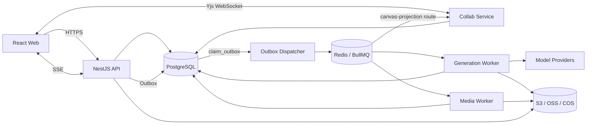

# 漫剧无限画布产品、体验与技术蓝图

**文档状态：** 开发准备基线；完成第 20 节决策门后方可编码<br>
**编制日期：** 2026-08-23<br>
**产品工作名：** 漫剧无限画布<br>
**目标版本：** MVP / Desktop Web<br>
**目标读者：** 产品、设计、前端、后端、算法接入、测试、运维、内容与合规团队

## 1. 执行摘要

本产品不是“把若干 AI 模型摆到画布上”，而是一套面向漫剧的生产操作系统。它把故事、剧本、角色与场景设定、分镜、图片、视频、配音、字幕、时间线、审核、成本和导出统一到一套可追溯的数据模型中。

首版只服务一个明确闭环：用户导入或编写剧本，系统辅助拆解为场景和镜头；用户锁定角色、场景和画风；批量生成并挑选分镜图；生成镜头视频与配音；在轻量时间线中校正时长、字幕和音量；最终导出 1080 x 1920 H.264 MP4、SRT 和项目清单。

产品的五个底层约束如下：

1. **画布表达生产依赖，时间线表达播放顺序。** 两者可以互相定位，但不能共用一个排序模型。
2. **节点配置、Generation Job、候选资产、当前采用版本相互分离。** 修改提示词或重新生成不得覆盖历史结果。
3. **角色、场景、镜头、台词和资产全部用稳定 ID 关联。** 名称和提示词不是引用键。
4. **上游变化只使下游过期。** 系统展示影响范围、预计费用和预计耗时，由用户决定是否重跑。
5. **批量、版本、失败恢复、成本预估和可审计性属于首版基础能力。** 它们不能作为发布后的补丁。

## 2. 参考 LibTV 的边界

2026-08-23 对 LibTV 公开首页、Skill 页面和公开实测资料的核对显示，它的主要产品范式包括：

- 手动创建工作流，或由 Agent/Skill 生成工作流。
- 在无限画布中连接文本、脚本、图片、视频和音频节点。
- 双击空白处创建节点，多选图片作为组合参考。
- 脚本拆分镜、批量生成分镜图、由分镜图批量生成视频。
- 单镜头修改提示词并重新生成，使用九宫格分割、多角度和角色三视图等图片工具。
- 聚合多种生成模型，支持批量重跑、模板复用和公开创作过程。
- 提供导演台、逐帧拉片、Skill/Agent 和 API 等扩展入口。

本产品对这些能力采取三种处理：

| 处理 | 能力 | 本产品做法 |
|---|---|---|
| 首版采用 | 无限画布、类型化节点、多选引用、批量运行、模型聚合、模板 | 按漫剧领域重做数据模型和界面，不做通用视频工具 |
| 首版强化 | 角色一致性、资产版本、成本控制、失败恢复 | 设定圣经、不可变运行快照、候选选优、stale 影响分析、费用预留 |
| 后续再做 | Agent 全自动导演、公开 Skill 市场、3D 导演台、逐帧拉片 | 分别进入 P1/P2，先验证核心生产闭环 |

不得复制 LibTV 的品牌、图标、文案、页面结构细节或受保护视觉资产。参考仅限公开可见的工作流范式和用户问题。

参考资料：

- [LibTV 官方首页](https://www.liblib.tv/)
- [LibTV 官方 Skill 页面](https://www.liblib.tv/skill)
- [公开实测：LibTV 一键生成脚本分镜](https://zhuanlan.zhihu.com/p/2019489463273801042)

### 2.1 参考证据等级

| 观察 | 来源与日期 | 证据级别 | 本产品决策 |
|---|---|---|---|
| 首页可见新建画布创作、项目、LibTV Agent、Skill，另有导演台和逐帧拉片入口 | 官方首页公开 DOM，访问核对 2026-08-23 | A：官方直接观察 | 采用“项目直接进入创作工具”；任务跨页面持续是本产品独立设计 |
| Skill 按短漫剧、电影、商业广告、创意/社媒玩法、音乐 MV 等分类 | 官方 Skill 页面公开 DOM，访问核对 2026-08-23 | A：官方直接观察 | MVP 仅做内置竖屏漫剧模板，不做公开市场 |
| 文本/脚本/图片/视频/音频节点、双击创建、多选参考、批量重跑 | 第三方公开实测正文，访问核对 2026-08-23 | B：可复核第三方操作记录 | 采用类型化节点、多选引用和批量预检；实现前以原型测试验证 |
| 九宫格、多角度、角色三视图、逐帧拉片、3D 导演台 | 官方入口加第三方实测 | B：部分官方、部分第三方 | 作为 P1/P2 候选，不进入 MVP 承诺 |
| 具体视觉、快捷键、错误恢复和成本行为 | 公开资料不足 | C：未证实 | 不推断为 LibTV 规格，按本产品用户研究独立设计 |

研究记录只说明可见事实和可信度。后续竞品复核必须记录账号状态、浏览器、日期、操作路径、截图/链接和是否亲测，营销文案不能当作可用性证据。

### 2.2 交互采纳矩阵

| 公开可见范式 | 决策 | 本产品的具体落点 |
|---|---|---|
| 进入项目即看到可操作画布 | 采纳 | 不做营销首屏；空画布只保留导入剧本、使用模板、添加节点 |
| 双击空白快速建节点、端口拖出兼容节点 | 采纳并强化 | 同时提供 `N`、菜单和大纲键盘等价路径；`Tab/Shift+Tab` 只负责焦点导航，端口类型/基数在创建前过滤 |
| 多图组合参考 | 采纳并强化 | 每个参考绑定 canonical resource/version/follow policy，Generation Job 固化实际版本 |
| 脚本拆镜与批量图片/视频 | 采纳并强化 | 先展示结构化 diff、缺失项、费用和失败策略；成功项不因部分失败回滚 |
| 单镜头重生成与多候选 | 采纳并强化 | Job 与资产不可变，Selection 与 Approval 分离，提供 Triage 队列 |
| 模型聚合与切换 | 改造 | 只显示适配器实测支持的能力；价格/输入/质量证据变化必须重新确认 |
| Agent/Skill 自动搭工作流 | 限制采用 | MVP 仅做模板、结构化解析和可审阅差异；通用多步骤 Agent 延后 |
| 公开模板/创作过程 | 拒绝进入 MVP | 只提供签名的内置竖屏漫剧模板，不公开项目数据或建立市场 |
| 3D 导演台、逐帧拉片、多角度高级工具 | 延后 | 由 P1/P2 用户研究决定，不预留首屏入口 |
| 未公开的错误、计费、快捷键与权限行为 | 独立设计 | 不推断 LibTV 行为；以本蓝图的幂等、费用预留、恢复和可访问规则为准 |

## 3. 产品定位

### 3.1 目标用户

MVP 的 primary persona 是“对一集从剧本到交付结果负责、已经使用过至少一种 AI 图片或视频工具的独立主创/小工作室主创”。新手创作者是 onboarding 验证人群，编剧、美术、配音后期和审核人是同一闭环中的专业协作者；不得用次要角色的 P1 需求改变 MVP 主路径。

| 用户 | 主要任务 | 当前痛点 | 产品成功标准 |
|---|---|---|---|
| 独立漫剧主创 | 一人完成脚本到成片 | 工具切换多、生成不可控、不会专业剪辑 | 低学习成本完成可发布短片 |
| 3 至 10 人工作室 | 多集、多角色、多成员并行生产 | 进度不透明、设定漂移、返工失控 | 稳定周更，交付时间和成本可预测 |
| 编剧/故事编辑 | 导入已有单集剧本、拆场拆镜、改对白 | AI 直接覆盖原文，修改后镜头关系丢失 | 结构化改稿且差异可追踪；小说改编与自动拆集留到 P1 |
| 美术/分镜师 | 定妆、场景、构图、镜头设计 | 脸、服装、画风、站位不一致 | 用较少重生成获得可批准镜头 |
| 配音/后期 | 声音、字幕、剪辑、交付 | 台词变更牵连时长，素材版本混乱 | 快速得到规格统一的成片 |
| 审核人/IP 方 | 内容、人物与成片审核 | 意见无法准确定位，版本混淆 | 评论绑定对象和版本并形成闭环 |

### 3.2 核心 JTBD

- 当我已有一集剧本时，我要快速得到可编辑的场景、镜头和生产清单，以便判断是否能在预算内完成。小说/梗概到分集剧本的改编属于 P1。
- 当我要生成几十个镜头时，我要稳定复用同一角色、服装、场景、画风和声线，只人工处理异常镜头。
- 当我修改一处设定或台词时，我要立刻知道会影响哪些镜头、音频和导出，并只重做必要部分。
- 当每个镜头有多个候选时，我要并排比较、选定、批准和回退，避免下游使用错误版本。
- 当批量任务运行时，我要看到排队、耗时、费用和失败原因，并能暂停、取消或只重试失败项。
- 当团队审核时，我要把意见绑定到具体镜头、时间码和资产版本，并核验返工结果。

### 3.3 产品原则

1. 先展示当前项目和可操作内容，不做营销式首屏。
2. 画布用于组织关系，检查器用于精确参数，Composer 用于自然语言辅助。
3. 自动化产生提案和差异，用户明确接受后才改动项目数据。
4. 费用操作必须展示范围与估算，不能因上游变化自动扣费。
5. 生成永远产生新版本，恢复旧版本也产生新的当前版本。
6. 状态同时使用文字、图标和颜色，关键动作始终有可见菜单入口。
7. 桌面端负责完整创作，手机端负责查看、评论、批准和任务控制。

## 4. 范围与版本边界

### 4.1 MVP 必须形成的闭环

- 工作区、项目、剧集、场景、镜头的基本结构。
- 桌面无限画布：节点、类型化端口、连线、框选、多选、群组、自动保存、撤销重做、搜索和大纲视图。
- 单集中文剧本粘贴或 UTF-8 TXT/Markdown 上传、结构化剧本编辑、AI 辅助拆解和人工差异审阅；原文上限 20,000 汉字。
- 角色、地点、道具和画风资产库，支持不可变版本、引用跟随策略和镜头绑定。
- 图片上传或外部 HTTPS URL 导入、图片生成、候选对比、选用、批准和回退；URL 导入只创建异步 Media ingest，不由 API 取回内容。
- 视频生成、基础 TTS、音乐/音效上传，以及稳定的静帧运镜降级方案。
- 批量预检、费用预估、任务队列、取消、失败分类和仅重试失败项。
- 基础时间线：镜头排序、裁切、时长、字幕、对白、音乐音量、淡入淡出、硬切/叠化和代理预览。
- 1080 x 1920 H.264 MP4、SRT、素材包和可复现导出清单。
- stale 影响提示、不可变运行快照、项目快照、软删除、崩溃恢复和额度账本。
- 至少接入一个图片模型、一个视频模型和一个 TTS 模型；所有供应商接入同一适配契约。
- 基础异步审核：命名审阅快照、对象/版本/时间码评论、Issue、viewer/commenter 权限和手机查看/批准/取消排队任务。
- 项目内多集的创建、重命名、复制、归档和切换；一次只打开一个 Episode 的画布和时间线。
- 手机端只读候选比较；项目级已批准资产可被不同 Episode 以精确 pinned 版本复用，复制 Episode 时不复制资产字节或历史审批。

### 4.2 P1 工作室效率

- 小说/梗概到分集剧本的辅助改编、跨集设定连续性和批量建集。
- 平板画布基础编辑、手机轻量参数修改与高级多候选审片工具。
- 多供应商自动兼容建议，但切换前仍需用户确认价格和质量差异。
- 局部重绘、首尾帧、口型、自动音效、代理渲染。
- 跨集连续性批量管理、跨项目资产包复用、项目级成本/进度报表、平台导出预设。
- 模板团队共享、EDL/XML 工程交换和高级审阅报表。

### 4.3 P2 平台化能力

- 实时多人协作 UI、分支与合并、团队模板市场。
- 自定义节点/插件 SDK、公开 Skill 市场、API 自动化。
- 多语言配音与字幕、直接发布和平台数据回流。
- 自动连续性检测、自动导演 Agent、LoRA 训练、3D 导演台和高级合成。

### 4.4 能力版本矩阵

| 能力 | MVP | P1 | P2 |
|---|---|---|---|
| 剧本 | 已有单集剧本结构化编辑/拆镜 | 小说改编、跨集连续性 | 自动编剧与数据回流 |
| 图片 | 生成、候选、比较、选择、批准 | 局部重绘、扩图、多角度 | 自训练与高级一致性检测 |
| 视频 | 单参考图生成、静帧运镜 | 首尾帧、口型、自动音效 | 3D 导演与高级合成 |
| 协作 | 异步评论、Issue、审阅快照 | 高级报表与团队模板 | 实时多人、分支合并 |
| 设备 | 桌面编辑；平板/手机查看、候选比较、评论、批准和任务控制 | 平板基础编辑、手机轻编辑与高级比较 | 多端能力按研究扩展 |
| Agent | 受控差异提案 | 多步骤可审阅工作流 | 自动导演与开放 Skill |
| 时间线 | 轻量剪辑与服务器导出 | 代理渲染、EDL/XML | 专业后期集成 |

每项能力只能属于一个首发版本。实现计划和发布验收若引入 P1/P2 能力，必须先更新本表、工期和相应测试。

### 4.5 明确不做

- MVP 不复制完整专业 NLE，不做复杂关键帧动画、调色和高级特效。
- MVP 不开放任意第三方前端 JavaScript 插件。
- MVP 不做声音克隆；只提供有明确商用许可的预置 TTS 声线。
- MVP 不做自动发布到第三方平台。
- MVP 不承诺手机端复杂布线和大规模画布编辑。
- MVP 不解析 PDF/DOCX，不从长篇小说自动改编成分集剧本。

## 5. 完整生产链路与完成门槛

| 阶段 | 结构化结果 | 完成门槛 |
|---|---|---|
| 立项 | 平台、题材、受众、集数、画幅、帧率、语言、时长、预算、权利声明 | 能估算镜头量、时间和成本 |
| 故事 | 主题、世界观、人物关系、总纲、分集钩子 | 每集冲突、转折和结尾明确 |
| 剧本 | 场次、动作、对白、旁白、情绪、预计时长、稳定 Line ID | 说话人无歧义，目标时长合理 |
| 设定圣经 | 角色、服装、表情、声线、场景、道具、画风和禁用特征 | 主角色、常用场景和主画风均有批准版本 |
| 剧本拆解 | 场次、角色、地点、道具、动作、连续性状态映射 | 文本实体全部映射 canonical ID |
| 分镜/预演 | Beat、景别、构图、机位、动作、运镜、时长、转场和临时 TTS | 台词全部落镜，总时长可播放检查 |
| 图片生产 | 关键帧、候选、参考组合 | 每镜头至少一个当前或批准关键帧 |
| 配音/音频 | 对白、旁白、读音、情绪、音乐、音效和 ducking | 内容、说话人、时长、响度通过检查 |
| 视频生产 | 单参考图视频、静帧运镜、动作延展、Take | 时长、脸部、动作和首尾可用 |
| 时间线 | 镜头、字幕、气泡、音轨、转场、裁切和混音 | 无缺失素材，代理预览连续 |
| 审核返工 | Issue、责任人、严重度、版本对比和复验 | Blocker/Major 清零或有书面豁免 |
| 导出发布 | 母版、SRT、封面、元数据、AI 标识、版权清单 | 规格与内容 QC 通过，manifest 可复现 |

推荐设置五个审批基线：剧本锁定、设定锁定、分镜锁定、粗剪锁定、最终 QC。锁定可以显式解除，但解除前必须展示影响范围。

## 6. 信息架构

### 6.1 数据层级

```text
Workspace
└─ Project / Series
   ├─ Story & Style Bible
   ├─ Characters / Locations / Props
   └─ Episode
      ├─ Scene
      │  ├─ Beat
      │  ├─ Shot
      │  │  ├─ Line
      │  │  ├─ Generation Job / Attempt
      │  │  └─ Asset Version / Take
      │  └─ Review Issues
      ├─ Canvas
      └─ Timeline
         ├─ Track
         └─ Clip -> selected Asset Version
```

画布节点只是领域实体的视图和操作入口。节点位置、分组、连线，以及生成/辅助节点自身的执行配置由画布文档负责；项目、剧本、角色、镜头、资产、任务、额度、审核记录和 stale 失效记录由业务数据库负责。领域节点通过 `resourceRef` 引用领域对象，领域字段必须从数据库读取，不能在 Yjs 中复制第二份可编辑真值。

### 6.2 全局导航

- 项目
- 模板
- 全局素材库
- 生成任务
- 团队
- 模型与额度
- 设置

### 6.3 项目导航

顶部一级模式只保留：`画布 / 故事板 / 时间线`。

- 画布：生产依赖、节点组织、批量生成和影响查看。
- 故事板：按集、场、镜头顺序选片、审片和比较版本。
- 时间线：成片时序、字幕、音频、转场和代理预览。
- 剧本、素材、任务、历史和导出从侧栏或抽屉进入，避免一级导航拥挤。

项目名右侧常驻 Episode selector，显示集号、标题、审批门和未解决问题数。它支持创建空白集、从现有集复制、重命名、归档、恢复和切换；一次只挂载一个 Episode 的 Canvas 与 Timeline。复制默认复用项目级角色、地点、道具和风格的精确版本引用，但不复制 Generation Job、Approval、Comment 或用量记录；复制前展示清单。存在运行中任务时仍可切集，任务进入全局任务托盘继续运行。归档前必须处理运行中任务，归档集只读且不出现在默认切换列表，恢复后生成新的活动 revision。

Episode 复制在一个 project fence command 中按固定矩阵执行，任一 contributor 缺失就整体失败：

| 内容 | 复制规则 |
|---|---|
| Script/Scene/Beat/Shot/Line | 创建新 Script 和 initial ScriptRevision；所有 Episode-local entity 使用新 ID 并保存完整 old-to-new map，源字节/hash 通过新的 provenance record 引用，不改原记录 |
| 项目级 Character/Location/Prop/Style/Asset | 不复制对象或字节；保留原项目内精确 pinned version 引用 |
| Canvas | 创建新 Canvas/full update；Canvas-local node/edge/group ID 确定性重映射，Episode-local `resourceRef` 按 ID map 改写，项目级引用保持精确版本；分配全新的 `documentEpoch`，剥离源 Canvas 的 projection marker/sequence/room epoch，目标 projectionSeq 从 1 开始 |
| Selection/Approval/Rejection/Comment/Issue | 不复制；新 Episode 从未选择/未审核开始 |
| Timeline | 创建新 Timeline/Track/Clip revision 和新 ID；保留时长、裁切、转场及精确媒体引用并把 sourceShotId 重映射，但全部标为待复验，Gate 未满足 |
| Gate/policy | 复用版本化 policy，不复制通过/豁免结果；实例重新计算 |
| Job/Attempt/Batch、费用、审计、Snapshot/Share/Export | 永不复制，只在源 Episode 保留 |

复制预览返回每类数量、精确复用版本、重置项和 blocker；确认请求携带源 Episode head 与预览 hash，任一 source head 变化返回 409 且不产生部分副本。

桌面路由固定为 `/projects/:projectId/episodes/:episodeId/{canvas|storyboard|timeline}`。剧本编辑器、素材、任务、历史和导出是保持当前模式上下文的工作区级抽屉或全屏工作视图；返回时恢复原来的选择、画布 viewport 或时间线 playhead。手机/平板审阅从项目列表进入 Episode 列表，再进入故事板、候选比较、时间码评论或批准详情，不加载可编辑画布。

## 7. 领域模型与状态

### 7.1 核心实体

- 身份与租户：`Tenant`、`User`、`Membership`、`Role`。
- 内容结构：`Project`、`Episode`、一集一个 `Script` aggregate、不可变 `ScriptSource`/`ScriptRevision`、稳定身份的 `Scene`/`Beat`/`Shot`/`Line`、内容寻址的 `StoryboardRevision`。
- 设定：`StoryBible`、`StyleBible`、`Character`、`CharacterVersion`、`Location`、`LocationVersion`、`Prop`、`PropVersion`、`Relationship`。
- 画布：`Canvas`、`CanvasNode`、`CanvasEdge`、`Frame`、`WorkflowTemplate`、`CanvasSnapshot`。
- 生成：`PromptRecipe`、`ModelDescriptor`、`GenerationJob`、`GenerationAttempt`、`Batch`、`JobEvent`。
- 素材：`Asset`、`AssetVersion`、`AssetVariant`、`Take`、`Selection`、`Approval`。
- 音频：`VoiceProfile`、`PronunciationEntry`、`MusicCue`、`SfxCue`。
- 时间线：`Timeline`、`Track`、`Clip`、`Caption`、`Transition`、`ExportManifest`。
- 协作与治理：`Comment`、`ReviewRequest`、`ReviewDecision`、`ReviewIssue`、`ApprovalGate`、`UsageReservation`、`UsageLedger`、`RightsRecord`、`ModerationRecord`、`AuditLog`。

### 7.2 正交状态模型

不要为节点或镜头设计一个巨大的单状态枚举。状态按以下维度独立计算：

| 维度 | 状态 |
|---|---|
| 就绪 | `blocked / ready` |
| Job 执行 | `pending / queued / dispatching / running / reconciling / succeeded / failed / canceled` |
| 取消请求 | `none / requested / acknowledged / unsupported / unknown`；Job 终态优先展示 |
| 审核 | `unreviewed / changes_requested / approved / waived` |
| 新鲜度 | `current / stale` |
| 批次聚合执行 | `idle / running / pausing / paused / canceling / partial / succeeded / failed / canceled` |
| 批准有效性 | `not_applicable / current / outdated` |

单个 Generation Job 没有 `partial`；只有聚合节点或 Batch 可以部分成功。每个 AssetVersion 天然是候选，`Selection`、`Approval`、`Rejection` 和 `Deprecation` 是独立追加记录，不把它们压成一个可覆盖的线性状态。<br>
审核问题状态：`open -> assigned -> in_progress -> resolved -> verified`，另有 `reopened / waived`。

Job、Attempt 与 Batch 使用独立状态机：

| 对象 | 状态与允许动作 |
|---|---|
| Job | `pending/queued` 可在未投递时原子取消并释放预留；`dispatching/running` 只能记录取消请求；`reconciling` 禁止重复提交；`succeeded/failed/canceled` 为终态。人工“原配置重试”始终创建带 `retryOfJobId` 的新 Job。 |
| Attempt | `prepared -> submitting -> submitted -> polling/recovering -> succeeded/failed/canceled`；提交结果不确定进入 `reconciling` 处理分支。只有系统恢复且有“确定未发送/未受理”的证据时才在原 Job 下创建新 Attempt。 |
| Batch | 确认后 `running`；暂停先进入 `pausing`、立刻阻止新投递，已运行 Job 继续到终态，未投递项释放预留，之后为 `paused`；恢复重新鉴权、预检、估价和预留，发生差异必须再次确认。取消进入 `canceling`，未开始 Job 原子取消，运行 Job 只发尽力取消；全部成员终态后才成为 `canceled`，并保留成功/失败/取消计数。未发生用户取消而成员结果混合时才使用 `partial`。 |

状态集合只定义一次并由所有 archive/snapshot/restore/retention/UI 逻辑导入：`TERMINAL_JOB_STATES = {succeeded,failed,canceled}`，`NONTERMINAL_JOB_STATES = {pending,queued,dispatching,running,reconciling}`，`isGenerationJobTerminal(state)` 只检查前者。不得在业务模块手写 `queued/running/...` 子集；加入新状态时，契约完备性测试必须迫使所有状态消费者更新。

`cancel()` 返回“请求结果”而不是 Job 终态。`accepted` 仅把取消维度记为 `acknowledged`，仍要等 poll/webhook 的终态证据；`unsupported` 保持 Job 运行；传输结果不确定记为 `unknown`，不得据此释放已使用费用或伪装成 `canceled`。所有状态转换使用 Job/Attempt sequence CAS，并写 Project event、审计和账本结果。

“锁定”拆成五个不同概念，界面不得混用：

| 概念 | 数据 | 作用 |
|---|---|---|
| 引用跟随策略 | `ResourceRef.follow = pinned/latest` | 决定上游新版本是否使引用更新/stale |
| 画布编辑锁 | `CanvasNode.editLocked` | 只阻止移动、删除和改节点配置，不代表内容批准 |
| 当前选择 | append-only `Selection` + current pointer | 决定故事板默认使用哪个候选 |
| 资产批准 | append-only `Approval` | 记录谁批准了哪个精确版本及范围 |
| 审批门 | `ApprovalGate` | 决定批次、时间线或导出能否继续 |

### 7.3 Generation Job、Attempt 与资产谱系

`GenerationJob` 表示一次用户确认后的不可变生成请求；`GenerationAttempt` 表示该 Job 对供应商的一次提交/恢复尝试；`GenerationBatch` 只聚合多个 Job。用户界面可以显示“本次生成”，但代码、API 和数据库统一使用 Job/Attempt/Batch，不再建立独立 Run 实体。

每次生成必须固化：

- 节点 ID 与节点 schema 版本。
- 上游实际采用的资产版本 ID。
- 角色、场景、画风的实际引用版本。
- 解析后的提示词、负面提示词和模型参数快照。
- 提供商、模型 ID、模型版本和适配器版本。
- seed、尺寸、时长、帧率和能力标识。
- 幂等键、外部任务 ID、提交人、开始/结束时间。
- 预计成本、预留成本、实际成本和计费状态。
- 输出内容哈希、存储位置、审核与权利元数据。

修改配置不会修改历史 `GenerationJob`。用户点击“恢复旧版本”时，系统创建新的当前选择记录，历史不可改写。

### 7.4 stale 传播规则

1. 上游领域对象或当前资产版本发生变化时，计算直接和间接下游。
2. 系统仅把受影响节点、时间线 Clip 和导出标记为 `stale`，保留历史 Approval 记录，但其派生 `approvalValidity` 变为 `outdated`。
3. 影响面板展示镜头数、已批准镜头数、预计费用、预计耗时和已有导出。
4. 用户选择传播范围：未来镜头、指定场景、所选镜头或全部引用。
5. 用户确认后才创建新批次；成功和失败结果分别处理。
6. 任何新输出仍作为候选，不能自动覆盖已批准资产。
7. 导出默认阻断 `stale + outdated approval`。Owner/Editor 可以逐项豁免，但必须记录操作者、原因、范围和时间；豁免不把旧 Approval 改回 current。

### 7.5 项目快照、恢复与运行中任务

`ProjectSnapshot` 是不可变的一致性清单，不替代数据库/对象存储备份。所有领域写入和投影事件分配都取得 project fence 的 shared lock；快照协调器取得短时 exclusive lock，记录各 Canvas projection high-watermark，等待 Collab 消费到该水位并 flush，再把快照写成 `staging`。每个成员/hash 全部验证后，单个 PostgreSQL CAS 才把它标记 `active`；崩溃恢复只续办或清理 staging，不暴露半个快照。

- `projectRevisionId`、各 `episodeRevisionId` 与领域对象 revision ID。
- 每个 Canvas 的 `documentEpoch`、`durableSeq`、Yjs state vector、canvas schema version，以及可从空 `Y.Doc` 直接应用的 content-addressed full update object/hash/bytes。ProjectSnapshot 对该对象建立 retention hold；后续 compaction 删除 update 或推进当前 Canvas snapshot 都不能影响历史恢复。
- 当前 `Selection` 指针、所引用的 `Approval` ID 与创建时的 `approvalValidity`。
- 每个 Timeline 的 revision ID、Track/Clip/Caption revision 和全部精确 `AssetVersion` 引用。
- `ApprovalGate`、未关闭 Review Issue、Rights/Moderation 决策 ID、stale 豁免和导出预设版本。
- 创建人、创建原因、应用版本、父快照和一致性时间。

普通命名快照允许存在 `NONTERMINAL_JOB_STATES` 中的 Job，但必须记录 Job ID、提交时的 project/episode/canvas head、输入快照 hash 和快照时状态，不包含其未来输出。恢复预览逐项列出这些 Job，并提供“保持运行但结果分离”与“尽力取消”选择，默认前者；release snapshot 只要存在会改变发布范围的非终态 Job 就阻断创建。所有模块调用同一 `isGenerationJobTerminal` 契约，禁止手写不完整状态列表。

恢复会生成新的 `projectHeadEpoch`，不取消仍在运行的任务。每个输出永久归属于 Job 提交时的 revision/head；完成时若当前 epoch/head 或输入 hash 已变化，资产仍正常入库并结算，但只进入 `detached/stale result` 集合，不自动加入恢复后 Shot 的候选、Selection、Timeline 或 Gate。用户必须比较提交时输入与当前 head，通过带当前 head CAS 的“附加为候选”命令显式接入；late success、late bill 和失败仍按原 Job 记录。这样恢复旧快照不会被快照后的异步结果静默污染。

恢复必须先展示领域、画布、选择、时间线和审批差异。确认后先 stage 新的 project/episode/timeline revisions；对每个历史 Canvas full update，在激活前生成一个新的内容寻址 derived full update：业务节点/边内容与历史 hash 验证结果一致，但剥离旧 projection marker，并写入新分配的 `documentEpoch` 与 `lastProjectionSeq=0`，历史对象本身绝不改写。单个 PostgreSQL 事务 CAS 原 head 后一次性切换所有 active head/revision pointers、增加 project head epoch、激活新 Canvas documentEpoch 和该 epoch 的 seq counter，并记录 `restoredFromSnapshotId`。Collab 按 active Canvas revision pointer 装载已 stage 的 derived update，不在激活后再补一个跨服务写入。旧 epoch 延迟事件只写 superseded receipt，不能应用到新文档；新领域事件从 `(newEpoch,1)` 开始。历史 revision、快照、Approval 和 Manifest 永不改写；失败恢复只留下旧 head 或完整新 head。恢复所引用的 AssetVersion/Yjs content object 受 retention hold 保护。

在 1000 logical nodes、200 AssetVersion、200 Clip 的基准项目上，创建快照和恢复预览 P95 均 `<= 5s`，确认恢复 P95 `<= 30s`。100 次在 fence、projection drain、Yjs 物化、stage 和 activate CAS 之间的崩溃注入不得产生混合 head；创建快照后经历多轮 compaction/update 清理仍可按 full update hash 100% 恢复。

## 8. 节点与连接目录

### 8.1 MVP 节点

| 类别 | 节点 | 主要输入 | 主要输出 |
|---|---|---|---|
| 内容 | 剧本 | 文本/文件 | 结构化剧本 |
| 内容 | 场景 | 剧本片段、角色/地点引用 | 场景实体 |
| 内容 | 镜头 | 场景、台词、角色、风格 | Shot 规格 |
| 设定 | 角色 | 描述、参考图 | 角色版本 |
| 设定 | 地点 | 描述、参考图 | 地点版本 |
| 设定 | 风格 | 描述、参考图、负面词 | 风格版本 |
| 设定 | 道具 | 描述、参考图、持有/损坏状态 | 道具版本 |
| 媒体 | 素材输入 | 上传文件/外部导入 | 资产版本 |
| 媒体 | 图片生成 | 镜头、角色、地点、风格 | 图片候选 |
| 媒体 | 视频生成 | 当前图片、镜头动作 | 视频 Take |
| 音频 | 配音 | Line、VoiceProfile | 音频 Take |
| 音频 | 音乐/音效 | 上传文件、剪辑参数 | 音频资产 |
| 合成 | 字幕 | Line、时间信息 | Caption |
| 合成 | 时间线入口 | 已选视频/音频/字幕 | Timeline Clip 引用 |
| 输出 | 导出 | Timeline、导出预设 | Export Manifest |
| 辅助 | 审核门 | 上游结果、审批规则 | 继续/暂停信号 |
| 辅助 | 便签/链接 | 文本/URL | 无执行输出 |
| 辅助 | Frame/Group | 子节点 | 组织容器 |
| 兼容 | 未知节点 | 原始数据 | 只读保留 |

### 8.2 边与端口规则

- `data` 边表示执行依赖，执行图必须无环。
- `reference` 边表示角色、风格、地点或素材引用，可以成环但不参与执行排序。
- `association` 边表示说明、评论或弱关联，不参与执行。
- 成片顺序不以画布边表示，而由 `Shot.orderKey` 与 Timeline 的 `trackId/startFrame/stackOrderKey/clipId` 管理。
- 左侧为输入，右侧为输出；端口必须声明数据类型、基数和必填性。
- 单值输入收到第二条边时弹出“替换/取消”，不得静默覆盖。
- 不兼容连接给出原因；转换必须经过显式转换节点。
- 删除上游后保留下游断链占位，提供恢复、重连和移除依赖。
- 旧客户端遇到未知节点时使用安全占位并完整保留原始数据。

## 9. 关键用户旅程

### 9.1 从剧本到首版成片

1. 在实际画布中创建空白项目或选择“竖屏漫剧”模板。
2. 粘贴/上传剧本，原文始终保留。
3. AI 解析集、场、镜头、角色、地点和台词。
4. 用户在差异审阅中逐项接受、编辑或忽略。
5. 系统创建场景 Frame、镜头节点和候选设定资产。
6. 用户确认画风、画幅、角色定妆和场景基准图。
7. 批量生成前展示数量、缺失项、模型、并发、费用和预计时间。
8. 任务在后台运行，用户继续编辑其他镜头。
9. 用户在故事板集中比较并选择每个镜头的当前版本。
10. 生成视频、配音与字幕，在时间线校正后运行导出预检并导出。

### 9.2 单镜头精修

1. 选择镜头或媒体节点，右侧显示它实际使用的角色、地点和风格版本。
2. Composer 编辑创作意图，检查器编辑结构化参数。
3. 生成 2 至 4 个候选，任务离开页面后仍持续。
4. 使用并排、叠加或同步播放比较候选。
5. 选择“设为当前”，必要时再“批准并锁定”。
6. 下游出现“输入已更新”，用户查看差异后决定是否重跑。

### 9.3 批量失败恢复

1. 批次可部分成功，成功项立即保留。
2. 失败项按限流、超时、权限、参数、内容审核、额度或服务不可用分类。
3. 用户可仅重试失败项、修改输入后重试，或明确更换兼容模型。
4. 系统自动恢复/重试在同一 Job 下新增 Attempt；用户修改输入或主动重生成时创建新的 Job ID，并保留原始输入版本和参数快照。
5. 外部任务成功但回调丢失时，系统通过外部任务 ID 恢复，不重复生成和计费。

### 9.4 审阅返工

```text
评论定位 -> 建立 Issue -> 影响分析 -> 从批准版本分支
-> 重做受影响资产 -> 新旧对比 -> 复验 -> 重新批准 -> 旧导出失效
```

评论锚点保存对象 ID、资产版本 ID、时间码或局部坐标，不能只绑定屏幕或画布坐标。

### 9.5 改稿与冲突处理

```text
打开当前 Episode 剧本 -> 修改/拆并场次或纠正说话人 -> 本地草稿
-> durable save / 三方冲突 -> 影响预览 -> 创建新 revision
-> stale 下游保持原版本 -> 用户选择范围、重新估价并确认
```

任何一步都不能改写原始导入文本、复用新的 Line ID 替换未受影响 Line，或因保存剧本直接创建付费 Job。

### 9.6 候选审片与时间线接续

```text
进入待处理队列 -> 比较候选 -> 设为当前 -> 独立批准
-> 下一异常镜头 -> 批量保护确认 -> 故事板锁定
-> 预览 Storyboard/Timeline diff -> 显式同步 -> 处理 orphan/手工冲突
```

刷新后恢复队列位置和每个追加决策；Storyboard 锁定不自动播种或替换 Timeline，只有用户确认的同步项产生新 Timeline revision。

## 10. 首屏和界面规格

```text
┌──────────────────────── 顶部栏 52px ──────────────────────────┐
│ 返回/项目名 | 画布·故事板·时间线 | 保存状态 | 任务·分享·导出 │
├──────┬────────────┬────────────────────────┬──────────────────┤
│工具栏│节点/素材抽屉│                        │ 选择项检查器     │
│ 52px │ 280px 可收 │       无限画布         │ 352px 可收       │
│      │            │                        │                  │
│      │            │      底部 Composer     │                  │
├──────┴────────────┴────────────────────────┴──────────────────┤
│ 左下：缩放/适配/小地图       右下：任务托盘/错误/同步状态     │
└───────────────────────────────────────────────────────────────┘
```

| 区域 | 规格 | 行为 |
|---|---:|---|
| 顶部栏 | 52px 固定 | 项目名原位编辑，保存状态常驻，导出是明确命令 |
| 左工具栏 | 52px | 节点、素材、剧本、模板、搜索，图标带 tooltip |
| 左抽屉 | 280px，可收，最小 240px | 搜索和拖入节点，关闭后画布扩展 |
| 画布 | 剩余空间 | 中性点阵/网格，不使用装饰性卡片 |
| 右检查器 | 默认 352px，范围 320 至 420px | 单选显示完整配置，多选显示混合值与批量属性 |
| Composer | `min(840px, canvasWidth - 32px)`，折叠高 64px | 固定在画布底部中央，不随画布缩放；展开高度受下方 `workRect` 公式限制，不足时切全屏 |
| 任务托盘 | 360px 抽屉 | 跨页面持续展示队列、费用和失败项 |
| 小地图 | 160 x 104px | 默认折叠，大项目或低缩放时提示展开 |

空画布中央只保留三个动作：`导入剧本`、`使用模板`、`添加节点`。右侧无选择时展示项目级画幅、帧率、默认风格和预算，不显示空卡片。

完整三栏只在 viewport `>= 1440px` 出现。`1280 - 1439px` 默认收起左抽屉，右检查器固定 320px；打开左抽屉时右检查器自动收起，用户可再以覆盖层打开。`1024 - 1279px` 的画布保留 52px 工具栏，左抽屉与右检查器均为至多 360px 的互斥覆盖层，打开一个必须关闭另一个；覆盖层关闭后焦点回到触发按钮。任务托盘不得与 Composer、缩放控件或费用确认动作重叠。

编辑/审阅模式由路由与已授予能力决定，CSS 宽度或页面缩放只能改变布局，不能把已打开的编辑路由静默切成手机审阅路由。`workRect` 固定为 viewport 减去顶部栏、工具栏、当前持久 dock 和折叠 Composer 后的无遮挡矩形；只有 `workRect.width >= 640 && workRect.height >= 480` 时画布与 dock 才能同时交互。若打开面板或展开 Composer 会低于该门槛，面板改成互斥全屏/模态工作视图并使背后画布 inert；展开 Composer 的最大高度为 `min(360px, 40vh, viewportHeight - topBarHeight - 480px - 32px)`，不足 160px 时改为全屏 Composer。覆盖层关闭后焦点回到触发按钮。

dock 变化导致选中节点落出新 `workRect` 时，系统把 viewport 平移到选中对象仍有 16px 可见边距；不改变画布 zoom，不把该个人 viewport 写入 Yjs。启用 reduced motion 时立即定位，否则使用不超过 180ms 的平移。1440/1280/1024 目标视口在 100%/125%/200% 页面缩放，以及 1280 宽页面放大到 400% 时，按同一 `workRect` 公式断言交叠面积为 0，`scrollWidth <= clientWidth + 1px`；二维画布可以自身双向平移。

## 11. 画布交互规范

### 11.1 导航、选择和坐标

- 空白区拖拽框选；`Space + 拖拽`、鼠标中键或手型工具平移。
- 滚轮纵向平移，`Shift + 滚轮` 横向平移，`Ctrl/Cmd + 滚轮` 缩放；触控板支持双指平移和捏合缩放。
- 双击空白处或在画布 surface 聚焦且无输入控件聚焦时按 `N` 打开节点快捷创建菜单；从端口拖到空白处只显示兼容节点。`Tab/Shift+Tab` 永远保留给焦点前进/后退。
- 单击节点选择，`Shift` 增减选择；框选从左向右要求完全包含，从右向左允许相交。
- `Escape` 依次关闭菜单、退出连线、清除选择、退出专注模式。
- 拖动时显示对齐线并吸附 8px 网格；按 `Alt` 临时关闭吸附。
- 文档坐标采用双精度逻辑像素，DPR 只参与渲染。缩放范围为 `0.05` 至 `4`，软边界为 `+/- 10^7`。
- viewport 属于用户个人偏好，不进入共享画布文档；子节点位置相对父 Frame/Group 保存。
- 连线只保存节点与端口 ID，不保存渲染曲线和绝对端点。

语义缩放等级：

| 缩放 | 展示 |
|---|---|
| `>= 0.85` | 完整节点、端口、主要参数和操作 |
| `0.45 - 0.84` | 缩略图、标题、状态和端口 |
| `0.15 - 0.44` | 类型、标题、状态色块和错误标记 |
| `< 0.15` | 聚合轮廓、Frame 标题和进度 |

拖拽和高速平移时临时降低细节，停止后恢复，节点尺寸和端口位置不得跳动。

### 11.2 节点

- 默认宽 280px，最小宽 240px；视频/图片预览固定项目画幅比例。
- 头部包含类型图标、名称、状态和更多菜单；内容只展示 2 至 4 个高价值参数。
- 复杂文本和参数在右检查器编辑，节点内不常驻大型表单或富文本编辑器。
- 双击标题或 `F2` 重命名，`Alt + 拖拽` 复制；复制生成结果时明确选择“只复制配置”或“同时引用当前资产”。
- 节点锁定后不能移动、删除或批量改参数，但可查看、复制和发起审核。
- 缺失必填输入时生成按钮禁用，并在节点与检查器中同时指出缺失字段。
- 删除进入撤销历史并显示 10 秒恢复入口；昂贵资产只软删除并延迟回收。
- 一张画布最多允许一个活跃视频播放器，其他视频节点只显示 poster。

### 11.3 边、群组和泳道

- 端口视觉尺寸 10 至 12px，透明点击热区至少 24 x 24px。
- `data` 使用实线，`reference` 使用虚线，`association` 使用点线；类型还需通过端口形状和图标区分，不能只依赖颜色。
- 运行中可以使用受控动画；系统启用减少动态效果时关闭持续动画。
- 边支持删除、改接、插入兼容节点和查看实际传递的资产版本。
- `Ctrl/Cmd + G` 成组，`Ctrl/Cmd + Shift + G` 解组。群组支持标题、标签、锁定、折叠和尺寸调整。
- 删除群组时必须区分“仅删除容器”和“删除容器及内容”。折叠群组显示节点数、运行数、失败数和聚合端口。
- MVP 的场景 Frame 用于组织；P1 可增加阶段泳道。泳道只改变视觉归属，不自动创建依赖或启动任务。
- 自动布局使用 Web Worker 中的 ELK.js，布局结果先预览，用户确认后才写入文档。

### 11.4 快捷键

| 动作 | Windows/Linux | macOS |
|---|---|---|
| 撤销/重做 | `Ctrl+Z / Ctrl+Y` | `Cmd+Z / Cmd+Shift+Z` |
| 复制/粘贴/重复 | `Ctrl+C/V/D` | `Cmd+C/V/D` |
| 全选当前作用域 | `Ctrl+A` | `Cmd+A` |
| 删除 | `Delete/Backspace` | `Delete/Backspace` |
| 群组/解组 | `Ctrl+G / Ctrl+Shift+G` | `Cmd+G / Cmd+Shift+G` |
| 重命名 | `F2` | `F2` |
| 快捷创建 | `N`（仅画布 surface） | `N`（仅画布 surface） |
| 生成所选 | `Ctrl+Enter` | `Cmd+Enter` |
| 搜索节点 | `Ctrl+F` | `Cmd+F` |
| 适配全部/所选 | `Shift+1 / Shift+2` | 同左 |
| 100% 缩放 | `0` | `0` |
| 快捷键帮助 | `?` | `?` |

输入框、文本域或参数控件聚焦时禁用画布字母快捷键。涉及费用的生成即使由快捷键触发，也必须经过费用确认。

## 12. Composer、检查器、故事板与时间线

### 12.1 Composer

MVP Composer 只做“可审阅的创作辅助”，不做无约束全自动 Agent：

- 无选择时可创建剧本、角色、地点、风格或镜头提案。
- 选中节点时读取结构化上下文，输出提示词/参数差异或新候选建议。
- 选中多个节点时先列出作用范围和不兼容项。
- 修改项目结构时先展示差异，用户可逐项接受或全部接受。
- Composer 发送不等于启动付费生成；生成仍走预检与费用确认。
- 所有 Agent 提案记录输入上下文版本、生成模型和接受结果，便于回溯。

### 12.2 右侧检查器

- 单选显示基本信息、引用版本、结构化参数、提示词预览、运行历史和审核状态。
- 多选显示混合值；用户勾选某字段后才覆盖全部，未勾选字段保持原值。
- 模型参数由服务端下发 JSON Schema 驱动，但必须映射到受控组件，不直接渲染不可信 HTML。
- 模型切换时显示兼容性、价格、最大时长、分辨率和预计质量差异。
- 当前版本、已批准版本、候选版本和上游实际版本在视觉与文案上明确区分。

### 12.3 故事板

- 以 `Episode -> Scene -> Shot` 排序展示镜头，不读取画布坐标推断顺序。
- 每镜头展示脚本摘要、角色、时长、当前图/视频、状态和问题数量。
- 支持列表、接触表和可播放 Animatic 三种视图。
- 支持按未生成、失败、stale、待审核、角色、场景和标签筛选。
- 图片比较支持并排、叠加透明度、拖动分割线和同步缩放。
- 视频比较支持同步播放、逐帧、波形、时长和音轨差异。
- “设为当前”和“批准并锁定”是两个明确动作。

候选审片提供独立 Triage 模式。一次审片会话先冻结 `triageSnapshotId`、过滤器、Shot 顺序和每个 Shot 的候选集合 hash；item key 固定为 `(triageSnapshotId, shotId)`。同一 Shot 的多个异常合并成一个 item，展示全部原因并以 `Blocker -> failed -> stale -> 待审核 -> Shot.orderKey -> shotId` 的最高严重度稳定排序。没有候选的 failed item 仍保留，动作是重试、修改输入/模型或带原因延后，不能假装完成。

主区固定显示当前镜头候选，右侧显示异常、引用和审批。`J/K` 移到下一/上一待处理镜头，`1-4` 选择对应候选，`S` 设为当前，`A` 批准当前版本，`R` 标记拒绝，`T` 打标签；输入控件聚焦时全部禁用。标签、拒绝单个候选或只打开失败详情都不完成 item；只有“精确 current 版本已批准且无 Blocker/stale”，或具有权限的用户创建带原因的 defer/waive Issue，item 才退出队列并自动前进。

每个动作携带 `triageSnapshotId + candidateSetHash + expectedSelectionHead + expectedApprovalHead`；任一 head 已变化返回 409、保留用户焦点并刷新 diff，不覆盖另一客户端结果。撤销使用 append-only 补偿记录；若已有依赖该 Approval 的 Gate、Timeline 或 Export，则普通撤销被阻断并要求新建审阅动作。

批量操作只作用于用户显式勾选的镜头：批量拒绝和标签不删除资产；批量批准只允许已有 current Selection、无 stale、无 Blocker、权利/审核通过的精确版本。确认面板列出作用范围和跳过原因，超过 10 个镜头时要求再次输入数量；任何批量动作都生成逐镜头记录，支持按操作批次撤销追加记录，不能覆盖历史。黄金样例中，熟练用户应在 15 分钟内完成 12 个镜头、每镜头 4 个候选的选用与批准，错误选用和错误批准均为 0，即有效审片吞吐不低于 48 镜头/小时；另以至少 100 个有金标准的独立决策测量 `triage_error_rate <= 1%`。

### 12.4 时间线

时间线是成片时序的唯一来源，MVP 包含：

- 一条主视频轨、多条对白/旁白轨、一条音乐轨、一条音效轨和字幕轨。
- 镜头重排、入点/出点、时长调整、音量、淡入淡出、硬切和叠化。
- Clip 始终引用精确 `AssetVersion` 和用于编辑/渲染的 immutable `AssetVariant`，上游切换或重新生成代理不会静默替换时间线素材。
- 台词变化导致音频时长变化时展示受影响 Clip 和字幕，不自动推挤整条时间线。
- 浏览器使用代理视频预览；最终成片由服务端 FFmpeg Worker 生成。
- 导出前检查黑帧、静音、低分辨率、字幕安全区、缺失素材、权限、审核和 AI 标识。

`ExportPreset.captionMode` 只允许 `burn-in+sidecar | sidecar-only`，MVP 默认 `burn-in+sidecar`，并始终交付规范 SRT。Manifest 冻结精确 Caption revision、字体版本、safe-area/layout recipe 和 mode；浏览器预览、SRT 与 FFmpeg burn-in 读取同一规范化文本和整数毫秒区间，不能各自改字或舍入。`sidecar-only` 输出 clean MP4 + SRT；`burn-in+sidecar` 输出烧录字幕 MP4 + 同源 SRT。

`StoryboardRevision` 是一个不可变、内容寻址的 Episode aggregate：它冻结 source ScriptRevision、按 Scene/Shot orderKey 排序的稳定 ID 与各自 revision、每个 Shot 在 image/video/voice/caption 等媒体角色上的当前 Selection head/精确 AssetVersion，以及 canonical hash。Storyboard head 是这些权威 head 的版本向量，不从 Canvas 坐标推导；任一剧本、Shot 或 Selection 变化都会形成新的版本向量，sync preview 在 project fence 的一致读中将其固化为 revision。

故事板与时间线使用显式同步，绝不自动覆盖：

1. Timeline 为空时，“从故事板创建时间线”按 `Scene/Shot.orderKey` 播种主视频 Clip，并记录 `sourceShotId`、`seededFromStoryboardRevision` 和精确 AssetVersion；缺少当前视频的镜头生成占位 Clip。
2. 之后新增、删除或重排 Shot 只产生同步差异徽标。用户点击“同步到时间线”后看到新增、已删除、顺序变化、素材变化和手工剪辑冲突五类 diff，可逐项接受。
3. 新增 Shot 默认建议插入最近相邻 source Shot 之间；删除 Shot 对应的 Clip 保留为 orphan，不静默删除。用户必须选择保留并解除 Shot 关联、从时间线移除，或重新关联。
4. 故事板重排只调整尚未手工移动或裁切的连续片段。已手工重排的 Clip 标记冲突，用户选择保留时间线顺序或采用故事板顺序。
5. Selection 改变只给对应 Clip 提供“更新素材”diff；接受后 Clip 创建新 revision 并引用新精确版本。Approval 变化只更新可导出性，不替换素材。
6. Preview 返回并持久化 `sourceStoryboardRevisionId + targetTimelineRevisionId + orderedDiffIds + diffHash`。每个 diff 使用由两端 revision、type 和 sourceShotId/clipId 派生的稳定 `diffId`。Apply 必须回传两端 revision 与 diffHash，并在同一 project fence transaction 对 Storyboard/Timeline 当前 head 双 CAS；任一 head 或候选集合变化都返回 409 `STORYBOARD_TIMELINE_BASE_CHANGED` 和新的 rebase preview，Clip、ledger、baseline 均写入 0。
7. 双 CAS 成功后，接受/拒绝/保留 Timeline 的选中 disposition、Clip 变更、新 TimelineRevision 和 append-only sync ledger 在同一事务提交。只处理部分 diff 时全局 baseline 不前移；下次预览从 ledger 和当前 Clip sourceRevision 计算，已处理项不重现、未处理项仍保留。所有当前 diff 都有 disposition 后才推进 `storyboardSyncBaselineRevision`。取消或关闭对话框不产生写入；两个客户端对同一 preview 并发 apply 时只允许一个成功。

12 镜头首次播种 P95 `<= 2s`，结构变化 P95 `<= 2s` 出现 divergence；同一 storyboard revision 重复同步 100 次不得产生额外 revision。未受影响 Clip 的裁切、音量、转场和精确资产引用保留率必须为 100%；双客户端 stale-preview 竞态产生一个成功、一个 409、零部分写入。

上传或供应商视频在进入 Timeline 前必须生成不可变的 25fps CFR mezzanine AssetVariant；Clip 精确记录 `assetVersionId + assetVariantId + objectVersionId + byteSha256`。25fps 主视频的所有 `startFrame/endFrame/inFrame/outFrame` 都在这一 25/1 master timebase 中，区间均为半开区间 `[startFrame,endFrame)` 与 `[inFrame,outFrame)`，且 `durationFrames=endFrame-startFrame=outFrame-inFrame > 0`；不能把 24/30/VFR source frame number 直接混入这些字段。显示时间码按每帧 40ms 换算。外部正数毫秒换算帧使用 `floor(ms * 25 / 1000 + 0.5)`，代理预览和最终导出读取同一 mezzanine/mapping，并裁切或补齐到请求的整数帧，不能各自舍入或运行时重新选 variant。

主视频轨不允许无解释重叠：硬切 `transitionDurationFrames=0` 且下一 Clip 从上一 Clip 的 endFrame 开始；叠化要求两 Clip 的重叠帧数严格等于 `transitionDurationFrames`，不得超过任一 Clip 时长的一半。空隙默认是导出错误，只有命名的 intentional-black/gap Clip 才合法。音频/字幕使用整数毫秒半开区间，可重叠但必须满足各自轨道规则。轨内确定顺序为 `startFrame/startMs + stackOrderKey + clipId`，同输入在 Web 预览和 FFmpeg 中必须得到同一 active Clip 集合。

### 12.5 结构化剧本编辑器

剧本使用专用全屏工作视图，不塞入节点或 352px 检查器。顶部是 Episode selector、revision/保存状态和“AI 辅助拆解”；左侧 240px 场次大纲支持拖拽排序，主区按场次编辑场景标题、时空、地点、动作、对白、旁白和预计时长，右侧只在差异审阅或冲突时出现。原始 TXT/Markdown 永久保留为只读来源。

每个 Episode 恰有一个 `Script` aggregate。`ScriptSource` 保存不可变原始 UTF-8 bytes、MIME、SHA-256 和来源；`ScriptRevision` 保存 `revisionId/scriptId/parentRevisionIds/baseRevisionId/operationId/createdBy/createdAt`，以及按 orderKey 排序的 Scene/Beat/Shot/Line version membership、tombstone 和 canonical content hash。`scripts.headRevisionId` 是唯一可变 head pointer；Scene/Shot/Line 的稳定 identity 与每次 revision 的字段版本分离。所有保存、拆分、合并、移动、恢复和 diff apply 在 project fence 内对 `expectedHeadRevisionId` 做 CAS，只通过一次事务追加 revision 并推进 head，历史 revision 永不改写。

API 至少包含 `GET /v1/episodes/:episodeId/script`、`PUT /v1/scripts/:scriptId`（结构化命令批次）、`GET /v1/scripts/:scriptId/revisions`、`GET /v1/scripts/:scriptId/revisions/:revisionId`、`POST /v1/scripts/:scriptId/revisions/:revisionId/restore`、`POST /v1/scripts/parse` 和 `POST /v1/scripts/:scriptId/apply-diff`。读取返回 head、source 和 revision ETag；保存/恢复/apply-diff 都要求 `Idempotency-Key + expectedHeadRevisionId + operationId`，冲突返回可用于三方合并的 base/head/local 结构，而不是覆盖。

- 新建 Line 时分配稳定 UUID；编辑文本、改说话人、跨场移动和重排都保留 Line ID。删除进入 tombstone，可从 revision history 恢复。
- 拆分场次时原 Scene 保留前半段和原 ID，后半段创建新 Scene ID，Line ID 不变；合并时目标 Scene 保留 ID，被合并 Scene 成为 tombstone，Line ID 仍不变。所有拆分、合并和重排先显示受影响 Shot、配音、字幕与 Approval。
- 说话人字段必须引用 canonical Character ID。未知名字进入“待映射”队列；纠正一次可建立本 Episode 的别名映射，但批量应用前展示命中行数和冲突。
- AI 解析只产生基于 `baseScriptRevisionId` 的结构化 diff。用户可逐项接受、编辑或忽略；接受时不匹配的 base revision 返回冲突，不得覆盖新文本。
- 保存采用 `baseRevisionId + operationId` 乐观并发。409 时显示 base、当前 head 和本地草稿的三方差异，可逐块选择；解决后创建新 revision。未提交文本每 2 秒写入本地草稿，权限撤销后只能导出本地备份，不能同步。

20,000 汉字首次可编辑 P95 `<= 1.5s`，输入反馈 P95 `< 100ms`，云端 durable save ack P95 `<= 2s`。场次/台词拆分、合并、移动和重排运行 1000 组性质测试，未受影响实体 ID 变化数为 0；刷新或崩溃恢复后已本地确认字符丢失数为 0。

## 13. 生成、批量、版本与错误恢复

### 13.1 任务状态和表现

节点就绪、Job、Attempt 和 Batch 不共用一个状态枚举。节点级前置状态如下：

| 节点状态 | 展示 | 可用动作 |
|---|---|---|
| 未配置 | 缺失字段和中性边框 | 补齐配置 |
| 可生成 | 模型和预估可见 | 生成、加入批量 |
| 上游已变化 | stale 和影响数量 | 比较、选择范围、重跑 |
| 额度不足 | 余额与缺口 | 降低规格或进入额度页 |

单 Job 的用户状态和动作固定为：

| Job 状态 | 展示 | 可用动作 |
|---|---|---|
| 排队中 | 队列图标和排位 | 取消、调整优先级 |
| 投递中 | 明确显示正在建立供应商提交 | 记录取消请求，不重复提交 |
| 生成中 | 已耗时和可信阶段，不伪造百分比 | 后台运行、尽力取消 |
| 对账中 | 供应商可能已受理，系统正在核对 | 查看原因、等待或联系支持；不可重复提交 |
| 成功 | 缩略图、耗时、费用、版本 | 预览、设为当前、批准 |
| 已取消 | 输入快照仍可查看 | 创建带谱系的新 Job |
| 可重试失败 | 错误分类和诊断编号 | 创建带 `retryOfJobId` 的新 Job、换兼容模型 |
| 不可重试失败 | 政策/权限/参数原因 | 修改输入或申请权限 |

Attempt 只在 Job 详情/诊断中展开：

| Attempt 状态 | 展示规则 |
|---|---|
| prepared/submitting/submitted | 显示 attempt 序号、submissionKey 后四位、可信传输阶段，不提供会产生第二 Job 的“立即重试” |
| polling/recovering | 显示次数、原因、下次查询时间；只允许停止自动查询或联系支持 |
| reconciling | 显示恢复证据与诊断编号；`unknown/unsupported` 自动重新 submit 次数必须为 0 |
| succeeded/failed/canceled | 显示外部 ID、终态证据和逐 Attempt 费用；历史不可覆盖 |

Batch 状态单独展示：

| Batch 状态 | 展示 | 可用动作 |
|---|---|---|
| running | 成功/运行/排队/失败计数和预留/实际费用 | pause、cancel、策略内调优先级 |
| pausing | 已阻止新投递，列出仍在运行的 Job | 等待、转 canceling |
| paused | 已完成项保留，未开始项无有效费用预留 | 重新预检后 resume、cancel |
| canceling | 未开始项已取消，运行项显示各自取消结果 | 等待、查看不支持/未知项 |
| partial | 所有成员终态且成功/失败混合 | 仅对失败项创建新 Job |
| succeeded/failed/canceled | 最终精确计数与费用 | 查看结果；失败重试创建新 Batch/Job 谱系 |

取消维度在 Job 主状态旁显示“取消请求中/供应商已受理取消/不支持取消/取消结果未知”；只有外部终态证据才能显示“已取消”。任务离开页面或刷新后不得消失。SSE 断线自动退化为轮询，数据库状态始终为任务权威状态。

### 13.2 批量运行

```text
选择范围 -> 依赖预检 -> 费用/耗时估算 -> 费用预留
-> 限流并发执行 -> 候选汇总 -> 人工选优/审核门 -> 下游继续
```

批量确认面板必须展示：总节点数、兼容数、跳过数、缺失配置、模型、候选数、并发、预计费用、预算上限、结果保留策略和失败处理策略。

批次支持暂停、恢复、取消未开始项、尽力取消运行项和仅重试失败项。暂停立即阻止新投递，允许已运行项完成，并释放未投递项预留；恢复必须重新鉴权、预检、估价和预留，输入/模型/价格变化时再次确认。取消竞态以每个 Job 的 CAS 胜者为准，late success/late bill 保留并对账。部分成功或用户取消不得回滚成功项。默认在候选选择处暂停；只有明确开启“粗预览”时才可按规则临时选择候选。

### 13.3 错误恢复

- 网络中断：本地继续保存 Yjs 操作，顶部持续显示“已保存到本机/尚未同步”。
- 自动保存失败：显示持久横幅并允许导出加密或压缩的本地画布备份。
- 提供商超时：保留外部任务 ID、输入、seed、模型版本和参数，可恢复查询。
- 提供商不可用：显示兼容模型与价格差异，不自动切换和扣费。
- 上传失败：分片续传；内容哈希命中当前租户已有文件时提示复用。
- 同步冲突：Yjs 自动合并结构操作；不可合并的业务命令生成冲突副本并进入差异审阅。
- 权限变更：未同步文本保留在本机并允许导出，协作连接立即断开。
- 内容安全拦截：显示违规类别和可修改范围，不暴露规则细节或只显示错误码。

## 14. 视觉、响应式与无障碍

### 14.1 设计令牌方向

界面应安静、专业、适合长时间工作，不使用单一紫色、深蓝色或大面积渐变主题。

- 浅色画布 `#F5F6F7`，表面 `#FFFFFF`，正文 `#171A1F`，边框 `#D9DEE5`。
- 深色画布 `#17191D`，表面 `#202328`，次表面 `#292D33`，正文 `#F2F4F7`。
- 主操作蓝 `#2563EB`，成功绿 `#16815D`，等待琥珀 `#C57A08`，失败红 `#D33C35`；AI 提示少量使用紫色。
- 间距采用 4、8、12、16、24、32px；控件圆角 4px，节点/面板 6 至 8px。
- 字号采用 12、14、16、20、24px，字间距固定为 0；节点正文以 12 至 14px 为主。
- 桌面控件高 32/36px，移动端触控目标至少 44px。
- 阴影只用于浮层和拖拽态；节点选中边框 2px，其他边框 1px。
- 动效 120/180/240ms，避免持续闪烁；图标统一使用 Lucide。

### 14.2 响应策略

布局断点只重排当前模式。`/canvas`、`/storyboard`、`/timeline` 与 `/review` 的路由和能力决定编辑或审阅；浏览器缩放导致 CSS 宽度变化时不得换路由、卸载编辑状态或撤销 Canvas session。真实手机默认进入 `/review`，MVP 不向 Mobile Review shell 申请画布编辑 token；已在桌面打开的 `/canvas` 放大到 400% 时保留可平移画布和等价大纲。

- `>= 1440px`：52px 工具栏、280px 左抽屉、剩余画布和 352px 右检查器组成完整三栏。
- `1280 - 1439px`：左抽屉默认收起，右检查器固定 320px；左右面板不能同时固定展开。
- `1024 - 1279px`：桌面紧凑编辑，左右面板是互斥覆盖层，Composer 仍按画布宽度公式布置。
- `768 - 1023px`：新会话默认故事板/列表审阅，可查看画布大纲但不承诺触控布线；若这是页面缩放后的既有编辑路由，则保留键盘可用的大纲和二维画布。平板触控画布编辑属于 P1。
- `< 768px`：Mobile Review shell 显示项目/剧集列表、候选比较、预览、评论、批准详情和任务控制，不请求编辑 token；既有桌面编辑路由在 400% reflow 时使用全屏互斥面板与等价大纲，不按此断点降权。

手机端不承诺大规模连线、群组重排或复杂时间线。任何关键动作不能只依赖 hover。

### 14.3 无障碍基线

- 满足 WCAG 2.2 AA：正文对比度至少 4.5:1，非文本控件至少 3:1。
- 焦点环至少 2px，焦点顺序与视觉顺序一致。
- 提供画布大纲/列表视图，使键盘和屏幕阅读器用户能创建、选择、连接、编辑和删除节点。
- 画布方向键移动到空间上最近节点，`Enter` 选择，`Tab` 进入节点内部控件。
- 边的可访问名称包含来源、目标、端口和数据类型。
- 生成状态使用 `aria-live="polite"`，只播报阶段变化，不连续打断。
- 视频预览支持键盘、字幕、静音状态和可读时间。
- 浏览器页面缩放与画布缩放是两个独立控制：页面缩放不得改变 Canvas viewport transform，画布缩放不得缩小工具栏、面板和文字。
- 在 1280 CSS px 宽页面放大到 400%（等效 320 CSS px）时，编辑路由保持不变；除二维画布本身外的导航、检查器、确认面板和错误信息单列 reflow、按需成为全屏互斥视图且无横向页面滚动。二维画布可双向平移，并必须提供等价大纲视图。
- 关闭 Dialog/Popover 后焦点回到触发器；删除选中项后焦点进入下一个同级项或其父容器；异步完成不得抢走当前输入焦点。
- 批量状态播报按批次聚合，最多每 2 秒一次；错误与字段使用 `aria-describedby` 关联。
- `prefers-reduced-motion` 下关闭运行边动画、平滑缩放和自动前进动画；200%/400% 页面缩放、长中文（正常文案两倍长度）和系统大字体均不得裁切命令或状态。

无障碍验证矩阵：

| 维度 | 自动化门禁 | 人工门禁 |
|---|---|---|
| 页面缩放 | 100%、200%、400% 截图与溢出断言 | 400% 等效 320px 完成项目切换、审片和费用确认 |
| 画布缩放 | 5%、15%、45%、85%、100%、400% 的 LOD/命中测试 | 通过大纲完成创建、连接、编辑、生成与版本选择 |
| 键盘/焦点 | Tab 顺序、焦点恢复、无 focus trap 泄漏 | 只用键盘完成黄金链路 |
| 读屏 | 可访问名称、状态聚合、表单错误关联 | Windows NVDA + Chrome、macOS VoiceOver + Safari |
| 动效/文本 | reduced-motion、200% 字号、两倍长中文 | 状态不靠颜色，内容不遮挡命令 |

CI 中 axe `serious` 或 `critical` 为 0 才可合并；`moderate` 必须有负责人和不晚于当前里程碑结束的修复期限。人工门禁出现无法完成任务、焦点丢失或错误不可感知均按 Blocker 处理。

## 15. 技术架构

### 15.1 推荐技术栈

| 层 | 选择 | 理由 |
|---|---|---|
| Monorepo | pnpm workspace + Turborepo | 共享契约、可独立构建部署 |
| Web | React 19、TypeScript、Vite | 以客户端工具为主，无 SSR 必要 |
| 路由/服务端状态 | TanStack Router、TanStack Query | 类型化路由与清晰远程缓存 |
| 画布 | `@xyflow/react` | 自定义节点、端口、框选和 DOM 表单成熟 |
| 协作文档 | Yjs、y-indexeddb、Hocuspocus | 离线、撤销、未来多人协作；首版可隐藏多人 UI |
| 瞬时 UI | Zustand | 仅存选择、hover、面板和拖拽预览 |
| UI | CSS variables/layers、Radix Primitives、Lucide | 令牌化、可访问、图标一致，并与 renderer 隔离边界保持简单 |
| API | NestJS + Fastify Adapter | 模块化单体、守卫、OpenAPI 和测试结构明确 |
| 数据 | PostgreSQL | 业务权威、事务、JSONB、RLS 防御 |
| 队列 | Redis + BullMQ | MVP 任务编排足够，易做限流、延迟和重试 |
| 文件 | S3 兼容对象存储 | 云端可切 S3/OSS/COS，本地用 MinIO |
| 媒体 | FFmpeg/ffprobe Worker | 代理、缩略图、波形和最终合成 |
| 实时状态 | SSE | 任务进度简单可靠，断线可轮询 |
| 观测 | OpenTelemetry、Sentry、Prometheus/Grafana | 端到端 trace、错误和容量指标 |
| 部署 | 五个 digest 固定 OCI 镜像 + Kubernetes 1.36/Kustomize | 本地 Compose 与生产拓扑同构，运行角色独立；ADR 按目标托管平台支持矩阵冻结最新可用 1.36.x patch，支持预发/生产 overlay、滚动回退和供应链证据 |

React Flow 的类型必须隔离在渲染适配包，`apps/web` 只能消费该包导出的 surface/renderer 接口；业务模型只依赖 `canvas-core`。500/1000 逻辑节点硬门禁不通过时先优化 LOD 与投影；5000/10000 压力趋势证明 React Flow 已到瓶颈后，才评估边的 Canvas/WebGL 图层或 PixiJS，且不迁移领域数据。

### 15.2 进程与数据流



首版采用模块化单体代码库和六个长期运行工作负载：Web、API、Collab、Outbox Dispatcher、Generation Worker、Media Worker。构建产物保持五种镜像；Dispatcher 复用 Generation Worker 镜像中的独立 entrypoint，但使用单独 Deployment、服务账号和 `comic_dispatcher`/Redis 凭据，绝不接收供应商、KMS、API 或 migrator 凭据。`canvas-projection` Outbox 由 Dispatcher 投递专用 BullMQ route，只有 Collab Projection Consumer 消费；Generation/Media route 只到各自 Worker，不能靠所有进程轮询同一表。五种镜像均使用非 root、只读根文件系统、健康探针、资源上限和精确 digest，Media Worker 镜像额外固定 FFmpeg/ffprobe、ClamAV 引擎与签名病毒库快照。依赖服务由托管 PostgreSQL/Redis/S3/OIDC/KMS 提供；Kubernetes base 与 staging/production overlay 不保存秘密，迁移只通过一次性 migrator Job 使用 owner 凭据，五个数据库 runtime role 各自最小授权。达到清晰的容量或组织边界后再拆微服务。

Collab 必须支持至少两个副本，不能假设 BullMQ consumer、WebSocket room 与内部 `flushRead` 总在同一 Pod。每个 Canvas room 通过 Redis 协调的短 lease 和 PostgreSQL 单调 `roomEpoch` 选出唯一 owner；所有 durable append 都携带 epoch 并在 per-Canvas advisory lock 内校验，失去 lease 的旧 owner 不能继续提交。非 owner 收到 WebSocket、`canvas-projection` 或 `flushRead` 时通过集群内 mTLS owner RPC 转发，不能在本地影子 `Y.Doc` 上确认成功；projection consumer 只有在 owner durable append marker 后才 ACK，任意 Pod 上的 `flushRead` 只有在 owner 返回同一 durable consistency point 后才响应。owner drain 时先停止接入、持久化已接收 update、发布 durable-append 通知并释放 lease；接管 Pod 增加 epoch、从 PostgreSQL active revision/updates 重建，再变为 ready。两副本测试必须覆盖“客户端在 A、投影由 B 消费、flush 命中 B、随后 A 在 rollout 中退出并由 B 接管”，证明 update/projection 无丢失、无重复、无旧 epoch 写入。

生产入口固定为一个 TLS Gateway/Ingress：`/` 只到 Web 静态 Service，`/v1` 与 provider webhook 只到 API，`/collab` WebSocket 只到 Collab；Dispatcher/Workers/health loopback 没有公网 Service。ADR-0006 必须按目标集群冻结可安装且受支持的 Gateway API controller 版本/镜像 digest、精确 `GatewayClass`/controllerName、证书签发与续期机制、外部负载均衡器行为及 controller-specific policy，不能只提交抽象 Gateway YAML。`/collab` 必须保留 WebSocket upgrade，客户端 keepalive 间隔 `<=20s`，gateway/LB idle timeout `>=120s` 且大于 room owner lease；`/v1/projects/*/events` SSE 必须禁用代理响应缓冲/压缩变换，15s heartbeat 立即 flush，stream timeout 禁用或 `>=15m` 以覆盖 10 分钟发布负载与重连窗口。Task 13/27 必须分别通过真实 TLS Gateway、两副本 Collab/API 路径验证长连接、rollout/failover、heartbeat 和 Last-Event-ID 重连，而不只直连 Pod。Gateway 终止 TLS 后到 API/Collab 使用集群内 TLS 或 service-mesh mTLS；应用只信任 ADR 固定的 proxy CIDR/hop 数，Gateway 先移除客户端自带 `Forwarded/X-Forwarded-*` 再重建。Webhook route 禁止会改写/解压 body 的中间件，API 在任何 JSON parse 前读取有大小上限的原始字节做签名验证。

原生 Kubernetes `NetworkPolicy` 不被假定能识别 FQDN。ADR-0006 必须冻结一种可执行边界：PostgreSQL/Redis/S3 使用私网 endpoint/CIDR，OIDC/KMS/签署 provider host 只经带工作负载身份和 FQDN/SNI allowlist 的 controlled egress gateway，任意用户或 provider output URL 只由 Media Worker 经独立 SafeFetch egress proxy 获取；API 的 URL-import facade 只鉴权并创建 Media ingest work，Generation Worker 只写 opaque ingest event，不直接下载 output CDN。应用 Pod 没有直连 DNS/Internet 的规则，只有两个 gateway/proxy 可解析 DNS 和访问各自签署目标。SafeFetch proxy 本身负责每一跳解析和 public-IP/协议/端口/redirect/字节/时间校验，连接时固定到刚验证的精确 IP，同时用原 host 做 TLS SNI 与证书 hostname 验证；redirect 必须重新解析验证，DNS 回应在校验后变化不能改变已固定的连接目标。Media 与 proxy 以 mTLS 身份和不可扩大的请求上限通信，proxy 不接受客户端指定的任意 pinned IP。NetworkPolicy 默认拒绝：Web server 只到 API/Collab，API 只到 PostgreSQL/S3/Collab 与 controlled gateway，Collab 只到 PostgreSQL/Redis/S3/API JWKS 和其他 Collab owner RPC，Dispatcher 只到 PostgreSQL/Redis，Generation Worker 只到 PostgreSQL/Redis/S3 与 controlled gateway，Media Worker 只到 PostgreSQL/Redis/S3 与 SafeFetch proxy；渲染清单测试逐进程验证 ingress/egress、gateway route class、FQDN allowlist、私网 CIDR 和凭据集合，任何 `0.0.0.0/0` 应用直出都失败。

### 15.3 四类状态的唯一来源

| 状态 | 唯一来源 | 内容 |
|---|---|---|
| 画布文档 | Yjs | 节点、边、位置、分组、生成/辅助节点配置和 `resourceRef` |
| 业务数据 | PostgreSQL | 项目、领域字段、权限、资产、任务、stale、额度、审核和审计 |
| 远程查询缓存 | TanStack Query | 项目列表、资产详情、任务状态和模型目录 |
| 本地瞬时 UI | Zustand | 选择、悬浮、框选、拖拽预览、面板和活跃播放器 |

不得把任务进度、上传进度、视频播放时间写入 Yjs；不得在 Zustand 再复制一份完整画布文档。

### 15.4 跨存储一致性

Yjs 与 PostgreSQL 不做伪分布式事务，采用显式、可恢复的投影协议：

1. Frame、便签、生成节点等纯画布对象直接由 Yjs 命令修改。
2. Scene、Shot、Character、Location、Prop、Style 等领域对象必须先通过 API 事务创建或修改；同一事务读取 active Canvas `documentEpoch`，在 `(canvasId,documentEpoch)` 提交序计数器的行锁下分配 `projectionSeq`，写入含稳定 `operationId + resourceRevision + documentEpoch + projectionSeq` 的 `canvas-projection` Outbox 事件。领域引用以 PostgreSQL `ReferenceBinding` 为权威，Yjs 的 reference edge 只是带 `bindingId` 的只读投影。
3. Collab Projection Consumer 消费事件，先比较 event epoch 与 active Canvas documentEpoch：旧 epoch 写幂等 superseded receipt 且不修改 Yjs，未来/未知 epoch 拒绝并报警。当前 epoch 只接受 `lastProjectionSeq+1`；在同一个 Yjs transaction 中比较 `lastProjectedRevision[resourceId]`，旧 resource revision 直接跳过，delete revision 写 tombstone，后到的旧 upsert 不能复活对象。通过检查后同时写节点变化、revision、epoch、projectionSeq 和 `meta.appliedOperations[operationId]`。含 marker 的 Yjs update durable commit 后才写 receipt，不能以内存 transaction 成功代替持久化成功。
4. UI 在 receipt 到达前显示“内容已保存，画布同步中”；投影失败可以重放，不回滚已提交的领域数据。
5. 用户从画布创建领域节点时，Web Command Coordinator 先调用领域 API，收到资源 ID 后等待投影；不得先写一个没有 canonical ID 的永久节点。
6. 网络“已同步”和服务端“已持久化”分开显示。生成前 Web 请求 Collab `flush/read` RPC；Collab 持久化当前更新后返回同一一致性点的 `stateVector + updateHash + durableSeq`。任务提交只传 `canvasId + nodeId + expectedStateVector/updateHash/durableSeq`，API 只从该 durable revision 重建配置并 CAS 校验；不信任浏览器提交的完整提示词或模型参数快照。
7. stale 根据 PostgreSQL Binding、Yjs data edge、Timeline/Manifest 精确版本引用和历史 Job lineage 联合计算，按 `follow` 规则传播，作为查询 overlay 显示在画布，不写回 Yjs。

`meta.appliedOperations` 只保存尚未完成两阶段去重固化的 operation：durable Yjs marker -> receipt -> reconciler 验证 marker/hash -> `dedupeFinalized`。watermark、marker 和 counter 都以 `(documentEpoch,projectionSeq)` 比较；压缩器只在 receipt 进入受保留保护、来源 Outbox 已 terminal、consumer watermark 已越过同 epoch projectionSeq 后移除 marker；此后永久 receipt 成为去重依据。这样既覆盖“Yjs 已写、receipt 未写”的崩溃窗口，也不让 Y.Doc 元数据无限增长。Episode copy 和 snapshot restore 都创建新 epoch/full update，绝不继承源或历史 epoch 的 sequence metadata。

### 15.5 Yjs 与持久化

- 一个 Canvas 一个 `Y.Doc`；节点和边分别以 `Y.Map` 按稳定 ID 存储。
- awareness 只承载光标、在线状态、选择和软锁，以 15 至 20Hz 限频，不持久化。
- Canvas 使用事务内锁定的 `canvas_heads.next_seq` 分配连续 update `seq`。每次 append 和 compactor 都取得同一个 per-Canvas transaction advisory lock，锁持有到提交；因此不存在“先分配低 seq、后于高 seq 提交”。压缩器在一个数据库事务内重建连续 `seq <= through_seq`、upsert `canvas_snapshot + state_vector + update_hash` 并删除相同水位的 update；更高 seq 只能在该事务提交后追加。
- `Y.UndoManager` 只追踪本地用户 origin；一次拖拽作为一个历史步骤，远端改动不进入本地撤销。
- `y-indexeddb` 缓存画布，Service Worker 缓存应用壳。离线时只能保存带 24 小时过期时间的生成意图草稿；重连后必须重新鉴权、flush durable revision、预检、估价并展示模型/价格/输入 diff，用户再次确认后才创建 Job。过期、权限撤销或输入变化的意图不能自动提交。
- 生成任务是外部副作用。撤销只撤销节点引用，不能伪装撤销已发生的模型费用。
- schema migration 必须确定且可重复；旧客户端不支持当前 schema 时进入只读。

## 16. 核心契约、存储与 API

### 16.1 渲染器无关的 TypeScript 契约

```ts
export type NodeId = string;
export type EdgeId = string;
export type AssetVersionId = string;
export type PortId = string;

export interface Point {
  x: number;
  y: number;
}

export interface Size {
  width: number;
  height: number;
}

export type NodeKind =
  | "script"
  | "scene"
  | "shot"
  | "character"
  | "location"
  | "prop"
  | "style"
  | "asset-input"
  | "image-generation"
  | "video-generation"
  | "voice-generation"
  | "audio"
  | "caption"
  | "timeline-output"
  | "export"
  | "review-gate"
  | "frame"
  | "note"
  | "unknown";

export type ResourceKind =
  | "episode"
  | "scene"
  | "shot"
  | "line"
  | "character"
  | "location"
  | "prop"
  | "style"
  | "asset";

export type ResourceRef =
  | { kind: ResourceKind; id: string; follow: "pinned"; versionId: string }
  | { kind: ResourceKind; id: string; follow: "latest"; versionId?: never };

export interface CanvasNode<T = unknown> {
  id: NodeId;
  kind: NodeKind;
  schemaVersion: number;
  parentId?: NodeId;
  position: Point;
  size: Size;
  orderKey: string;
  collapsed: boolean;
  resourceRef?: ResourceRef;
  data: T;
}

export interface PortRef {
  nodeId: NodeId;
  portId: PortId;
}

export interface CanvasEdge {
  id: EdgeId;
  kind: "data" | "reference" | "association";
  source: PortRef;
  target: PortRef;
  bindingId?: string;
}

export interface PortDefinition {
  id: PortId;
  direction: "input" | "output";
  dataType: string;
  required: boolean;
  cardinality: "one" | "many";
}

export interface NodeDefinition<T> {
  kind: NodeKind;
  latestSchemaVersion: number;
  validate(data: unknown): T;
  migrate(data: unknown, fromVersion: number): T;
  getPorts(data: T): readonly PortDefinition[];
}

export interface AssetVersionRef {
  assetId: string;
  versionId: AssetVersionId;
}

export interface GenerationJob {
  id: string;
  nodeId: NodeId;
  retryOfJobId?: string;
  status:
    | "pending"
    | "queued"
    | "dispatching"
    | "running"
    | "reconciling"
    | "succeeded"
    | "failed"
    | "canceled";
  providerKey: string;
  modelId: string;
  inputSnapshot: Record<PortId, readonly AssetVersionRef[]>;
  configSnapshot: unknown;
  outputAssetVersions: readonly AssetVersionRef[];
  idempotencyKey: string;
  canvasRevision: {
    stateVector: string;
    updateHash: string;
    durableSeq: number;
  };
}
```

`GenerationAttempt` 是 Job 的一次逻辑供应商提交，保存全局唯一 `submissionKey`、provider config、external ID、传输调用记录、标准化计费与恢复证据。只有“请求确定未发出”或供应商明确返回未受理时，自动重试才新建 Attempt；不确定提交若受供应商幂等键保护，可在同一 Attempt 内用同一 `submissionKey` 重调 `submit`。按 client reference 恢复时必须先查询，只有带证据的 `definitively_absent` 才能关闭旧 Attempt 并新建 Attempt；`unknown` 或 `unsupported` 直接进入 `reconciling`。用户明确再次生成候选时才新建 Job，并以 `retryOfJobId` 或 `candidateOfNodeId` 建立谱系。`GenerationBatch` 只保存成员 Job 与聚合控制状态。

### 16.2 主要数据库表

- 身份：`tenants`、`users`、`memberships`、`project_memberships`、`project_policies`、`api_idempotency_requests`。
- 内容：`projects`、`episodes`、`scripts`、`script_sources`、`script_revisions`、`script_revision_scenes`、`script_revision_beats`、`script_revision_shots`、`script_revision_lines`，以及稳定身份的 `scenes`、`beats`、`shots`、`lines`。
- 设定：`story_bibles`、`style_bibles`、`characters`、`character_versions`、`locations`、`location_versions`、`props`、`prop_versions`、`reference_bindings`、`resource_invalidations`。
- 画布：`canvases`、`canvas_snapshots`、`canvas_updates`、`canvas_projection_receipts`、`canvas_projection_nodes`。
- 素材：`assets`、`asset_versions`、`asset_variants`、`upload_sessions`。
- 生成：`generation_jobs`、`generation_attempts`、`job_events`、`project_event_stream`、`project_event_counters`、`generation_batches`、`provider_configs`、`model_catalog`、`provider_webhook_receipts`。
- 费用：`usage_reservations`、`usage_ledger`。
- 时间线：`storyboard_revisions`、`storyboard_revision_items`、`timelines`、`timeline_revisions`、`tracks`、`clips`、`captions`、`storyboard_sync_baselines`、`storyboard_sync_previews`、`storyboard_sync_ledger`、`export_jobs`、`export_manifests`、`render_evidence`、`qc_reports`。
- 快照与回收：`project_snapshots`、`project_snapshot_members`、`trash_entries`、`retention_holds`。
- 审核：`comments`、`review_requests`、`review_decisions`、`review_issues`、`selections`、`approvals`、`approval_gates`、`moderation_records`、`rights_records`、`audit_logs`。
- 可靠投递：`outbox_events`、`consumer_receipts`。

所有租户资源表含不可更新的 `tenant_id`。租户内外键使用 `(tenant_id, referenced_id) -> (tenant_id, id)` 复合约束或等价 constraint trigger，不能只凭全局 UUID；同租户用户向另一租户 Project/Asset/Job 写引用必须在数据库约束层失败。

生成表额外强制：`generation_attempts.submission_key` 唯一；非空外部任务 ID 使用 `(provider_config_id, external_id)` 部分唯一索引；webhook receipt 使用 `(provider_config_id, external_event_id)` 唯一约束；Job cancellation operation key 唯一且 cancellation 状态只能按允许图 CAS 前进。不能依赖应用层“先查后写”维持这些不变量。

迁移 owner 与运行时角色分离；`comic_api`、`comic_collab`、`comic_dispatcher`、`comic_generation_worker`、`comic_media_worker` 分别是 `NOINHERIT NOBYPASSRLS` 非 owner，按表/列/函数最小授权，Media Worker 不能读供应商凭据/账本，Generation Worker 不能读 quarantine 扫描器配置。所有含 `tenant_id` 的表同时 `ENABLE` 与 `FORCE ROW LEVEL SECURITY`，后台任务只能在取得已验证 scope 后于一个事务内 `SET LOCAL app.tenant_id/app.project_id`。

`comic_security_owner` 是唯一例外：它必须为 `NOLOGIN NOINHERIT BYPASSRLS`、不能被任何 LOGIN role 继承或 `SET ROLE`、不拥有业务 schema/table、只拥有经过迁移创建的窄 `SECURITY DEFINER` 函数并获得这些函数所需的最小表权限。所有函数 `REVOKE ALL FROM PUBLIC`，固定空安全 `search_path`、使用全限定名、校验 expected route/consumer、限制行数与返回列、写不可变审计；迁移测试枚举函数定义、owner、ACL 和调用正反例。五个 runtime role 的 `rolbypassrls` 必须始终为 false。

进入 FORCE RLS transaction 的 tenant/project scope 只能来自下列可信 bootstrap，不能直接相信 BullMQ/Webhook/HTTP body 自报 ID：

| 入口 | bootstrap 契约 |
|---|---|
| HTTP 用户命令 | 验证 OIDC issuer/audience/signature 后由 membership 查询得到 tenant，业务 guard 再验证 Project membership/capability |
| Canvas WebSocket | 验证非对称 Canvas session token 后，用 `bootstrap_canvas_scope(canvasId,sessionRevision)` 只返回 tenant/project/current session revision，再与 membership 取交集 |
| BullMQ/Outbox | 消息只携带 opaque `eventId/route/payloadHash`；目标 Worker 调 `bootstrap_work_event(eventId,expectedConsumer,expectedRoute)` 得到 tenant/project/subject，并校验 DB payload hash 后才开 tenant transaction |
| Provider webhook | 验签前函数只返回 providerConfigId 与 verification-secret ref；原始字节验签/时间窗/replay 通过后，`bootstrap_verified_provider_event(providerConfigId,externalId)` 才从 Attempt 返回 tenant/project/job，payload tenant 永不使用 |
| API -> Collab `flushRead` | mTLS/服务身份请求带 canvasId/requestId；Collab 用 `bootstrap_canvas_scope` 重取 tenant/project/active revision，禁止接受 API 传来的 tenantId 作为权威 |

跨租户 Outbox claim、上述 bootstrap 或验签前定位 webhook route 只能调用这些窄函数；runtime role 不能借此任意查询租户表。画布投影表只用于搜索与统计，不反向覆盖 Yjs 文档。

### 16.3 API 轮廓

| 方法 | 路径 | 用途 |
|---|---|---|
| `POST` | `/v1/projects` | 创建项目与默认剧集/画布 |
| `GET` | `/v1/projects/:projectId` | 项目摘要与权限 |
| `POST` | `/v1/projects/:projectId/episodes` | 新建或复制剧集 |
| `PATCH` | `/v1/episodes/:episodeId` | 重命名、归档或恢复剧集 |
| `POST` | `/v1/canvases/:canvasId/session` | 获取短期协作令牌和 schema 信息 |
| `GET` | `/v1/episodes/:episodeId/script` | 获取 Script head、source 和 ETag |
| `PUT` | `/v1/scripts/:scriptId` | 以 expected head 保存结构化命令批次 |
| `GET` | `/v1/scripts/:scriptId/revisions` | 列出不可变剧本 revision |
| `GET` | `/v1/scripts/:scriptId/revisions/:revisionId` | 读取精确 revision |
| `POST` | `/v1/scripts/:scriptId/revisions/:revisionId/restore` | 从历史 revision 创建新 head |
| `POST` | `/v1/scripts/parse` | 生成可审阅的结构化差异 |
| `POST` | `/v1/scripts/:scriptId/apply-diff` | 逐项接受解析结果 |
| `POST` | `/v1/uploads` | 创建 multipart upload session |
| `POST` | `/v1/uploads/:uploadId/complete` | 校验分片并创建资产 |
| `GET` | `/v1/assets/:assetId` | 资产、版本、变体和权利信息 |
| `POST` | `/v1/generation/estimate` | 校验依赖并估算费用与时间 |
| `POST` | `/v1/generation/jobs` | 创建单任务与费用预留 |
| `POST` | `/v1/generation/batches` | 创建批量任务 |
| `POST` | `/v1/generation/jobs/:jobId/cancel` | 尽力取消 |
| `POST` | `/v1/generation/batches/:batchId/pause` | 暂停未投递 Job |
| `POST` | `/v1/generation/batches/:batchId/resume` | 重做预检后恢复批次 |
| `POST` | `/v1/generation/batches/:batchId/cancel` | 取消未开始项并尽力取消运行项 |
| `PATCH` | `/v1/generation/batches/:batchId/priority` | 在策略允许范围调整优先级 |
| `GET` | `/v1/projects/:projectId/events` | 项目级 SSE 任务与资产事件 |
| `GET` | `/v1/projects/:projectId/events/snapshot` | replay gap 后的权威状态与 watermark |
| `GET` | `/v1/episodes/:episodeId/storyboard` | 获取当前 Storyboard 版本向量与有序 Shot |
| `POST` | `/v1/timelines/:timelineId/sync-preview` | 计算故事板同步差异 |
| `POST` | `/v1/timelines/:timelineId/sync` | 应用用户选定的同步项 |
| `PUT` | `/v1/timelines/:timelineId` | 以 base revision 保存时间线业务数据 |
| `POST` | `/v1/projects/:projectId/snapshots` | 创建命名或 release snapshot |
| `GET` | `/v1/projects/:projectId/snapshots` | 列表与恢复预览 |
| `POST` | `/v1/projects/:projectId/snapshots/:snapshotId/restore` | 恢复为新 head |
| `POST` | `/v1/exports/preflight` | 导出预检 |
| `POST` | `/v1/exports` | 创建合成任务 |
| `POST` | `/v1/comments` | 创建对象/版本/时间码评论 |
| `POST` | `/v1/review-requests` | 冻结审阅范围并送审 |
| `POST` | `/v1/review-requests/:requestId/decisions` | 记录通过或 changes-requested 决策 |

所有写接口接受 `Idempotency-Key`，服务端按 `(tenantId, actorId, operation, key)` 持久化 request hash 与原响应；同 key 不同语义请求返回 409。request hash 固定覆盖 operation ID、规范化 path params、排序后的语义 query 和 RFC 8785 风格 canonical body，不包含无语义的 header 顺序。幂等占位、业务副作用、Outbox/audit 和最终响应必须共享一个 PostgreSQL command transaction；请求上下文通过 AsyncLocalStorage 或等价显式 transaction 参数传递，禁止拦截器在业务提交后再单独保存响应。进程在“业务 effect 已写、HTTP response 未发”处崩溃，重放仍只能看到一个 effect 和原响应。

SSE 仅提供项目级 `/v1/projects/:projectId/events`。`eventId` 由该 Project 的计数器行在事件事务内加锁分配，锁持有到提交，因此按提交顺序连续；`jobSequence` 只做单 Job 状态 CAS，不能当重连 cursor。若 `Last-Event-ID` 早于 replay window，服务端返回 `EVENT_REPLAY_GAP`、项目状态 snapshot endpoint 和当前 watermark；客户端以 snapshot 原子替换 reducer 状态后，从 watermark 重新订阅。所有响应返回 `traceId`。错误采用稳定业务码、中文可执行文案和可选诊断详情，不把供应商原始错误直接展示给用户。

## 17. 生成与媒体管线

### 17.1 供应商适配器

```ts
export interface ModelProviderAdapter {
  readonly providerKey: string;
  readonly capabilities: readonly ModelCapability[];

  listModels(ctx: ProviderContext): Promise<readonly ModelDescriptor[]>;
  validate(request: GenerationRequest): ValidationResult;
  estimateCost(request: GenerationRequest): Promise<CostEstimate>;
  submit(request: GenerationRequest): Promise<ProviderSubmission>;
  recover(submissionKey: string): Promise<ProviderRecoveryResult>;
  poll(externalId: string): Promise<ProviderStatus>;
  cancel(externalId: string): Promise<ProviderCancellationResult>;
  parseWebhook(request: SignedWebhookRequest): Promise<ProviderEvent>;
  normalizeError(error: unknown): NormalizedProviderError;
}

export type ProviderRecoveryResult =
  | { kind: "found"; submission: ProviderSubmission; evidence: RecoveryEvidence }
  | { kind: "definitively_absent"; evidence: RecoveryEvidence }
  | { kind: "unknown"; reasonCode: string; evidence?: RecoveryEvidence }
  | { kind: "unsupported" };

export type ProviderCancellationResult =
  | { kind: "accepted"; evidence: CancellationEvidence }
  | { kind: "already_terminal"; status: ProviderStatus; evidence: CancellationEvidence }
  | { kind: "unknown"; reasonCode: string; evidence?: CancellationEvidence }
  | { kind: "unsupported" };
```

业务代码按能力选择模型，不判断供应商名称。模型描述必须包含输入/输出媒体类型、分辨率、时长、帧率、参考图、seed、首尾帧、取消、进度、webhook、提交恢复方式、参数 JSON Schema、价格、并发和区域。

结构化剧本拆解同样通过该契约的 `text-structured-output` capability 接入；ADR-0005 必须额外冻结主/备文本模型、JSON Schema 遵循率、区域、数据使用、价格和 100 份脱敏剧本评测。没有通过契约测试的文本模型时，只允许人工结构化编辑，不能把模拟适配器用于生产。

### 17.2 创建任务事务

一个 PostgreSQL 事务必须完成：

1. 校验权限、节点配置、输入版本、模型能力和内容政策。
2. 固化输入、提示词、模型、适配器和参数快照。
3. 计算并预留预计费用。
4. 插入 `generation_jobs` 与首个 `job_event`。
5. 插入 transactional outbox。

Outbox Dispatcher 通过数据库函数原子 claim `pending` 或 lease 已过期的记录，写 `claimedBy/leaseUntil/attemptCount/nextAttemptAt` 后提交，再投递 BullMQ。Broker ACK 只 CAS 记录 `publishedAt/brokerJobId`，绝不等同业务 delivered；目标 Consumer 完成或确认永久终态后，才在同一业务事务写唯一 `(consumerName,eventId)` effect receipt 并把对应 Outbox 标为 `terminal`。进程在发送后、记录 ACK 前崩溃时允许 lease 到期重投；queue `jobId=eventId` 只去重仍存在的 Redis job，不能代替数据库 receipt。Reconciler 定期查找 `published` 已超观察窗但没有下游 receipt 的事件，确认 BullMQ job 丢失/不可达后重新入队；重复消息由下游 receipt 保证业务 effect 一次。发布失败按有上限的指数退避+jitter 推进 `nextAttemptAt`，超过 ADR 次数进入 dead-letter 并报警；心跳只能延长本 Dispatcher 持有且未过期的 lease，不能永久占用。reclaimer、两个 Dispatcher 竞争、发送后崩溃、broker ACK 后 Redis job 丢失和 effect 后 receipt 重放都必须有集成测试。

Dead-letter 不是 effect terminal，也不能满足 Canvas marker finalization。系统保留原 Outbox payload hash、attempt 证据和所有 receipt，提供仅 Operations 可执行的 `requeue_outbox(eventId,expectedAttempt,reason)` 窄 SECURITY DEFINER 命令：它以 CAS 追加审计 repair record、清除 claim/published broker identity、推进 attempt generation 并回到可投递状态，但不改 eventId/payload。运行手册先校验根因、consumer 幂等性和 payload hash，再批准重放；`canvas-projection` 的 N 进入 dead-letter 时 N+1 保持未 ACK，重放 N 成功后按序推进 N+1 和 snapshot drain。未经该修复 receipt 的 dead-letter 事件永远不能被当作已完成或被 GC。

Dispatcher 再把任务投递 BullMQ。指数退避加 jitter 可直接用于 `poll`、`recover`，以及供应商明确声明“未受理”的限流/5xx。`submit` 的连接重置、超时和多数 5xx 都可能已经受理：只有本地证据证明请求字节未发出，或供应商有经过契约测试的 idempotency-key 保证时，才允许自动重调；后一种情况必须复用同一 Attempt 和同一 `submissionKey`。client-reference 模式先 `recover`，`unknown`/`unsupported` 不重提。鉴权失败、参数错误、内容违规不自动重试。Provider webhook 必须先由签名与窄路由函数确定唯一 `providerConfigId`，再以 `(providerConfigId, externalEventId)` 幂等；tenant/job 只能从对应 Attempt 反查，不能信任 webhook payload 自报租户。没有 webhook 时轮询。

调用供应商前先持久化稳定 `submissionKey`。适配器必须声明提交恢复方式：供应商幂等键、按 client reference 查询，或不支持恢复。Worker 重启先解释 `recover(submissionKey)` 的判别结果：`found` 绑定原外部任务；`definitively_absent` 只有在 evidence 通过适配器契约验证后才允许新 Attempt；`unknown` 与 `unsupported` 都进入 `reconciling` 并停止自动提交，由对账流程确认外部任务/账单后再落终态。不能把空值或网络失败解释为“供应商没有受理”。

Job cancel command 先在数据库 CAS 写 `cancellation=requested`、审计和 Outbox；未投递 Job 可同事务进入 `canceled` 并释放预留，已经 dispatch 的 Job 由 Worker 调用一次适配器 `cancel`。`accepted` 只记 `acknowledged` 并继续 poll；`already_terminal` 按带证据状态结算；`unsupported` 保持运行；`unknown` 不自动重发取消请求，改为查询/人工对账。只有供应商明确声明并通过契约测试的 cancel idempotency 才可在同一 cancellation operation key 下重调。任何 late success 都作为未选候选保留，任何 late bill 都追加账本调整。

费用流程固定为 `estimate -> reserve -> settle/release`。MVP 一个 tenant/project 只允许一种冻结的 ISO 4217 currency；Provider estimate/status/event 的 currency 不匹配时在提交或入账前拒绝并进入人工对账，禁止隐式换汇。只有尚未 dispatch 的 Job 允许预留过期；Dispatcher 投递时在同一事务确认或延长预留。

每个 Attempt 的实际费用通过幂等 `record_attempt_charge(attemptId, providerChargeId, amountMicros, currency, evidenceHash)` 追加，一次 Job 可以有多个真正计费的重试 Attempt，Job 最终 settlement 是这些 charge 的精确和。取消先释放未使用预留；若随后收到带证据的 late bill，不改写旧 release，而是追加 cancellation-late-bill adjustment 并按项目策略标记 overage/reconciliation。Provider status/event 必须返回标准化金额、currency 和计费证据；外部供应商是否对取消计费必须在确认面板和账本中准确表达。

### 17.3 上传与资产处理

1. 本地文件路径由客户端请求 upload session；外部导入路径提交 HTTPS URL、声明媒体类型与大小上限。
2. API 校验权限、格式、大小、配额和请求结构。本地文件返回短期 multipart signed URL；外部导入只持久化受 RLS 保护、短期有效的 fetch instruction 并写 opaque Media Outbox，不解析 DNS、不建立网络连接。
3. 本地文件由客户端直传对象存储，不通过 API 转发大文件；外部内容只允许 Media Worker 通过独立 SafeFetch proxy 流式写入 quarantine，URL 不进入 BullMQ、日志、对象 key 或 FFmpeg 参数。
4. 本地完成接口校验分片、校验和与幂等键；外部导入以 instruction ID、payload hash 和最终下载 hash 幂等，过期 instruction 必须由用户重新确认。
5. 原件先写入租户隔离的 quarantine prefix，资产状态进入 `uploaded -> scanning -> processing -> ready`；扫描前 API、CDN 和其他 Worker 均不能读取。
6. Media Worker 做 MIME 魔数识别、病毒扫描、ffprobe、EXIF 清理和转码；供应商生成输出 URL 必须先走与 URL 导入相同的 SafeFetch 协议/DNS/IP/重定向/长度/MIME 校验，再流式写入同一 quarantine 管线，Worker 不直接跟随 Provider 返回的 URL。
7. 生成缩略图、poster、代理视频、波形和必要的预览变体；可进入 Timeline 的视频必须额外生成并冻结 25fps CFR mezzanine 的 variant/object version/hash/转换 recipe。
8. 原始文件只通过短期签名 URL 访问，代理资源由 CDN 分发。

资产不可变，编辑产生新版本。对象 key 只使用 opaque ID，不使用用户原文件名；跨租户不做透明去重。URL 导入每次解析及每次重定向都重新校验协议、公网 IP、DNS pinning、长度和 MIME。7 天未完成的 multipart session 由 reaper 调用 AbortMultipartUpload 并清理临时对象。

删除先软删除，超过保留期后由 plan/execute 两阶段 GC 处理。live set 至少包含 ReferenceBinding、Selection、Approval、Job 输入/输出、Timeline/Manifest、评论/Issue、命名审阅与分享 snapshot、Rights/Moderation evidence、QC report、legal/retention hold 和尚未安全压缩的 Yjs 引用。执行删除前把 AssetVersion CAS 到 `deleting` 并在同一事务再次验证 live set；所有新引用写入必须拒绝 `deleting`，恢复或新 hold 可把计划作废。对象删除成功后才写 tombstone。独立 reaper 处理超过策略窗口且从未形成 AssetVersion 的 quarantine orphan，以及无 hold 的 rejected quarantine object；它不能复用 live Asset GC 的宽查询。

### 17.4 何时从 BullMQ 迁移 Temporal

满足任一条件时评估 Temporal：单流程跨数小时或数天、包含大量人工审批暂停/恢复、补偿流程复杂、Webhook signal 很多，或 Worker 崩溃恢复语义已难以维护。首版不为假设需求引入该复杂度。

## 18. 安全、权限与合规

### 18.1 项目级能力授权

角色不是可比较的等级。OIDC principal 只携带用户与租户身份，项目角色必须从 `project_memberships` 查询，再由 `authorize(principal, projectId, capability, projectPolicy)` 计算。能力固定拆为：`project:view`、`content:edit`、`canvas:edit`、`generation:spend`、`asset:upload`、`asset:select`、`asset:approve`、`timeline:edit`、`snapshot:create`、`snapshot:restore`、`job:cancel-own`、`job:cancel-any`、`comment:create`、`issue:manage`、`share:manage`、`export:create`、`stale:waive`、`rights:manage`、`retention:manage`、`project:admin`。

| 角色 | 固定能力 | 受项目策略控制 | 明确禁止 |
|---|---|---|---|
| Owner | 全部能力 | 无 | 无 |
| Editor | 查看、内容/画布/时间线编辑、上传、选择、评论、Issue、快照创建、导出 | 生成消费、批准、快照恢复、stale 豁免、权利管理 | 项目所有权、账单和 retention 管理 |
| Generator | 查看、上传、生成消费、选择、取消自己的任务、评论 | 内容/画布编辑、导出 | 分享、批准、快照恢复、stale 豁免、retention 管理 |
| Commenter | 查看、评论 | 无 | 编辑、生成、选择、批准、导出 |
| Viewer | 查看 | 导出已批准 release snapshot | 编辑、生成、评论、选择、批准 |

HTTP、Yjs WebSocket、上传签名、SSE 和任务提交分别鉴权。Collab 向 Viewer 发送完整 document sync，但拒绝其 document update；awareness 写权限按项目策略控制。权限撤销后主动断开现有协作连接并作废短期上传/协作令牌。

接口能力映射是显式 allowlist：项目/Episode 管理=`project:admin`，剧本/设定=`content:edit`，画布 document update=`canvas:edit`，上传=`asset:upload`，生成/批次创建=`generation:spend`，Selection/Approval=`asset:select/asset:approve`，Timeline/同步=`timeline:edit`，快照创建/恢复=`snapshot:create/snapshot:restore`，评论/Issue=`comment:create/issue:manage`，分享=`share:manage`，导出=`export:create`，stale 豁免=`stale:waive`，权利=`rights:manage`，垃圾箱/GC=`retention:manage`。每个测试除跨 tenant 外，还必须覆盖“同 tenant、无该 Project membership”的拒绝。

### 18.2 安全基线

- 使用 OIDC authorization code + PKCE；短期 access token 与轮换 refresh token 仅驻留内存，刷新页面通过 IdP 会话 `prompt=none` 恢复并在失败时显式登录，任何 token 不进入 localStorage、sessionStorage 或 IndexedDB；本地开发使用隔离的 Keycloak realm。
- 供应商 submit/API key 使用独立 KMS key policy，只允许 Generation Worker 解密；Webhook ingress 只能解密单独分类的 `webhook-verification` secret，不能读取 submit key。验签必须使用原始请求字节、时间窗与 replay key；通过后在数据库事务中写 provider-event Outbox，BullMQ 仍只携带 `{eventId,route,payloadHash}`，由 Consumer 通过受审计 bootstrap 取回权威 payload/scope，不再引入第二套事件签名密钥。
- 富文本使用 allowlist 清洗，启用 CSP、CSRF 防护、严格 CORS 和安全响应头。
- URL 导入阻止内网 IP、DNS rebinding、跨域重定向和超大响应，防止 SSRF。
- 上传检查 MIME 魔数、病毒、像素、时长、压缩炸弹和文件名注入。
- 按租户限制并发、频率、日预算和单任务成本。
- 提示词和媒体默认不进入日志、崩溃报告或第三方分析系统。
- 审计使用服务端时间，记录操作人、对象、版本、费用和请求来源。

### 18.3 内容与权利

- 项目立项时记录原作改编权、上传素材权利、字体/音乐许可和真人肖像授权。
- 输入与输出都保留 Moderation Record；拦截、申诉和人工豁免形成审计链。
- 生成资产保留模型、参数、来源、操作者、AI 标识和版权声明元数据。
- 国内上线前完成数据驻留、个人信息保护、生成内容显式/隐式标识、未成年人和内容审核的专项法律评审。
- 声音克隆需单独的授权采集、撤销和证据链，因此不进入 MVP。

AI 标识不是发布清单上的人工备注。每个首发目标平台对应一条签署并版本化的 `AiDisclosurePolicy`，固定是否需要可见覆盖层、机器可读 MP4 metadata、伴随 sidecar、准确文案、已许可字体版本、位置和展示区间。只要 Manifest 含生成资产，导出预检必须绑定该策略；法定要求不可豁免，Media Worker 只能按 Manifest 渲染一次，QC 校验像素区域、metadata/sidecar hash，ZIP 与 Manifest 同时保存披露证据。策略变化产生新 Manifest 和新导出，不回写历史成片。

## 19. 性能、可观测性与质量策略

### 19.1 性能预算

规模术语必须在指标和测试中保持一致：

- `logical node/edge`：Yjs 文档中存在且参与图查询的对象，无论是否进入当前 viewport。
- `visible node`：几何边界与 viewport 相交的节点。
- `mounted node`：viewport 加 overscan 投影后实际挂载的 DOM 节点，MVP 上限 400。
- `detailed node`：以最高 LOD 渲染预览、端口和参数的节点，上限 300；其余 mounted 节点使用摘要 LOD。

MVP 常规档为 500 logical nodes/800 edges，支持上限为 1000 logical nodes/1600 edges；这两档是发布硬门禁。5000/10000 logical nodes 只用于非阻塞压力趋势和渲染器切换判断，不是 MVP 功能承诺或发布门禁。标准 fixture 中媒体节点占 40%、领域节点占 40%、辅助/Frame 占 20%，80% 节点有缩略图，边跨越长度按黄金项目分布生成。

| 项目 | 目标 |
|---|---|
| 500 节点冷启动首个可交互 | P75 `<= 2.5s` |
| 1000 节点冷打开 | P95 `<= 5s`，局部可先用 |
| 常规 500 节点平移/缩放 | 基准设备 `>= 50fps` |
| 500 节点 30 秒交互 1% low | `>= 30fps` |
| 指针到画面反馈 | P95 `< 50ms` |
| 拖拽/选择/输入反馈 | P95 `< 100ms` |
| 本地搜索筛选 | `< 200ms` |
| 普通一次画布同步 | 原则上 `< 100KB` |
| 任务状态延迟 | P95 `< 2s` |
| 导出成功率 | `>= 98%` |
| 重复扣费 | `0` |
| 1000 节点峰值 JS heap | `<= 1.2GB` |

编码前先用 100、500、1000、5000、10000 logical nodes 数据做性能 Spike：500/1000 按硬门禁给出 go/no-go，5000/10000 只记录启动、查询、内存和失败模式。若 1000 档无法稳定达标，在增加业务功能前决定优化 React Flow 投影、把边移到 Canvas/WebGL，或切换 renderer；压力档结果不得反过来把 MVP 范围扩大。

基准环境冻结为：Windows 11、4 个性能核或同级 CPU、16GB RAM、集成显卡、1920 x 1080、DPR 1、Chromium Tier A 当前稳定版、接通电源；网络为下行 50Mbps/上行 10Mbps、RTT 50ms。冷缓存清空 HTTP cache、Service Worker、IndexedDB 和图片缓存；热缓存保留上轮缓存。每档先预热 3 次，再分别运行冷/热至少 5 次，报告每次原始值、P50/P75/P95、JS heap 和 long task，不能只报最好结果。

前端实现视口裁剪和 500 至 1000 屏幕像素 overscan，使用空间索引做框选与区域查询；只加载 256/512px 代理图，自动布局放 Web Worker，媒体销毁时释放对象 URL、播放器和监听器。

### 19.2 可观测性

同一 `traceId` 贯穿浏览器、API、Outbox、BullMQ、Provider 和 Media Worker。核心指标包括：

- 画布冷启动、FPS、长任务、内存、同步时延和重连成功率。
- API P50/P95/P99、错误率和授权失败。
- 队列等待、执行时间、重试、取消和死信。
- 各模型成功率、超时率、内容拒绝、成本和并发占用。
- 上传成功、转码耗时、代理生成和 CDN 命中。
- Yjs update 大小、snapshot 压缩时间、文档大小和房间人数。
- 每租户、项目、批次和任务的成本归因。

日志必须结构化并脱敏。前端错误进 Sentry，服务端 trace/metric 进入 OpenTelemetry 与 Prometheus/Grafana；供应商异常配置 circuit breaker 和报警。

### 19.3 测试金字塔

- 纯领域：Vitest + fast-check 覆盖坐标互逆、端口兼容、DAG、stale 传播、迁移和费用账本性质。
- Yjs：两个以上客户端并发增删改最终收敛，本地撤销不撤销远端修改，离线恢复后收敛。
- 组件：React Testing Library 覆盖节点、端口、检查器、状态、错误和键盘交互。
- 集成：Testcontainers 启动 PostgreSQL、Redis、MinIO，验证 Outbox、幂等、重复 webhook、供应商成功后 Worker 崩溃恢复和跨租户隔离。
- 契约：每个 Provider Adapter 运行相同 contract suite；API OpenAPI schema 与前端类型一致。
- E2E：Playwright 覆盖首条纵向链路、批量部分失败、刷新恢复、版本比较、时间线和导出。
- 性能：k6 压 API/SSE/队列，Playwright trace 与自定义 FPS 基准压画布；基准数据进入 CI 趋势。
- 无障碍与视觉：执行第 14.3 节矩阵，明确区分页面缩放与 5%/15%/45%/85%/100%/400% 画布缩放，并覆盖中英文长文本。

### 19.4 QC 与黄金样例门禁

技术 QC 使用版本化 `qcProfileId`，平台预设可以收紧但不能绕过项目权利与审核门。MVP 默认竖屏母版要求：1080 x 1920、25fps CFR、H.264 High Profile/yuv420p、AAC-LC 48kHz stereo 192kbps；输出时长与 Timeline 相差不超过 1 帧，首尾 A/V drift `<= 80ms`，综合响度 `-16 +/- 1 LUFS`，true peak `<= -1 dBTP`。

两种 caption mode 都校验 Caption/SRT 的完整性、整数毫秒时码、0.5 至 7 秒时长、中文阅读速度 `<= 15 字/秒`、相邻不重叠，以及“存在台词却缺字幕”。只有 `burn-in+sidecar` 对 MP4 画面执行字体授权、最多两行和 x=54..1026、y=96..1728 安全区像素/布局 QC；`sidecar-only` 不对 clean MP4 误做字幕像素检查，但 SRT 缺失仍阻断。画面 98% 以上像素亮度低于 5/255 且持续 `>= 120ms` 视为黑帧，除非 Timeline 上存在命名的 intentional-black 标记。存在台词的区间连续静音超过 500ms、缺失/损坏素材或低于预设分辨率均阻断导出；AI disclosure overlay 的字体/安全区按独立 policy 在两种 mode 下照常检查。

| 严重度 | 判定锚点 | 发布处理 |
|---|---|---|
| Blocker | 无法播放/导出、错集错版本、缺素材/声音/字幕、权利或内容审核缺失、严重身份错位 | 必须为 0，不可普通豁免 |
| Major | 主角色一致性低于 3/5、对白错人/错句、A/V drift 超 80ms、连续明显动作/口型异常、字幕越安全区 | 必须修复；Owner 与最终审核人双签且写明范围才可豁免非合规项 |
| Minor | 不影响理解的短暂抖动、轻微构图/音量/标点问题 | 记录数量和趋势，可带已知问题发布 |

每个黄金成片由两名独立评审按角色身份/服装/画风连续性 1 至 5 分评分：均值 `>= 4.0`，任何主角色镜头不得 `< 3`；严重度加权 Kappa `>= 0.60`，否则先校准评分锚点再复评。导出必须保存 Timeline revision、Selection/Approval、`captionMode`、Caption revision/layout recipe、字体、qcProfile、FFmpeg/container 和命令参数；每个实际渲染输入必须冻结 `assetVersionId + assetVariantId + objectVersionId + byte SHA-256 + detected media metadata + transform recipe`，Media Worker 禁止在运行时按“最新/默认代理”重新选择 variant。相同 Manifest 在同一固定 Media Worker 镜像连续 3 次重渲染，归一化音视频流 hash 一致率必须 100%；任何输入、variant、object version、caption mode/revision/layout、renderer 或工具版本变化都必须产生新 Manifest，不能冒充同一可复现导出。

可复现字节规则固定如下：Manifest 采用 RFC 8785/JCS 兼容的 canonical JSON 并以 UTF-8 无 BOM 编码；SRT 由整数毫秒生成稳定序号与 `CRLF` 无关的规范 UTF-8/LF 字节；ZIP entry 按规范化相对路径逐字节排序，使用固定 UTC mtime、固定 Unix mode、固定压缩级别且禁止额外字段；MP4 写出时移除 creation_time、encoder、随机 ID 和非必需 metadata。跨三次渲染比较的媒体归一化 hash 不直接 hash container bytes，而是分别把视频解码为按展示顺序连续的 RGB24 frame bytes、音频解码为固定 48kHz stereo signed PCM bytes后做 SHA-256；帧数、采样数和各自 hash 全部写入 QC 报告。ZIP/Manifest/SRT 本身则比较精确字节 hash。

## 20. 开发前决策门

以下项目必须在编码前形成 ADR。表内给出默认推荐，只有明确证据才改变：

“规划基线完成”和“开发冻结”是两个不同状态。本文件当前只表示前者；不得把默认推荐、研究 protocol 或空模板解释为已批准决策。Task 00 最终生成单一 `development-freeze-record.md`，逐行引用所有 ADR/研究/供应商/品牌字体/工程/法律运营证据；只有该记录本身被接受，Task 01 才能开始。

Freeze Record 每行固定包含 `gateId/finalDecision/evidenceLinksOrSha256/owner/requiredApproverRoles/approverIdentities/approvedAt/status/supersedes/unresolvedBlockers`。六个 ADR、用户研究、原型结果、黄金样例、四类供应商评分、品牌/字体、基础设施、RPO/RTO、合规和发布责任人必须全部出现；`status` 只允许 `accepted | blocked`，任何缺字段、占位文本、过期证据或 `blocked` 行都会使 verifier 非零退出。变更已接受决策必须新增 superseding record、重新取得受影响角色签名并重跑受影响门禁，不能原位改历史。

| 决策 | 默认推荐 | 改变条件 |
|---|---|---|
| 产品形态 | 漫剧生产 DAG，不做重度手绘 | 访谈证明自由绘制是前三核心任务 |
| 首版设备 | 桌面完整编辑，手机查看/审批 | 真实用户主要以平板生产 |
| 默认规格 | 9:16、1080 x 1920、25fps、60 至 180 秒/集 | 首发渠道另有硬规范 |
| 画布规模 | 500 常用节点，1000 节点可用 | 黄金样例显示单集显著更大 |
| 协作底座 | 首版 Yjs，隐藏多人 UI 也保留离线结构 | 明确永不支持协作且离线也不需要 |
| 后端 | NestJS 模块化单体 + 五个隔离后端工作负载 | 已有组织标准要求不同框架 |
| 编排 | PostgreSQL Outbox + BullMQ | 出现第 17.4 节的 Temporal 触发条件 |
| 身份 | OIDC，开发环境 Keycloak | 已选 SaaS 身份平台并通过区域/合规评估 |
| 存储 | S3 接口，本地 MinIO，生产按区域选 OSS/COS/S3 | 企业已有统一对象存储 |
| 部署运行时 | Kubernetes 1.36 + Kustomize；ADR 按目标托管平台支持矩阵冻结最新可用 1.36.x patch；本地/测试用同镜像 Compose profile | 企业已有通过 RPO/RTO、区域、密钥与不可变 digest 验证的托管容器平台 |
| 首发供应商 | 文本/图像/视频/TTS 各一主一备做评测，MVP 各启用至少一个 | 质量、价格、并发或条款评测不通过 |
| 数据区域 | 默认按中国大陆用户合规设计 | 产品明确只在其他区域运营 |
| 保留策略 | 项目软删除 30 天，临时上传 7 天，审计按法律评审 | 法律、合同或成本策略另有要求 |

### 20.1 MVP 兼容矩阵

| 层级 | 平台 | 承诺 |
|---|---|---|
| Tier A 完整编辑 | Windows 11 / macOS 14+；Chrome、Edge 当前及前一主版本；macOS Safari 当前主版本 | 所有 P0 E2E 100% 通过，P1 E2E `>= 95%` |
| Tier B 审阅 | Windows/macOS Firefox 当前主版本 | 项目、故事板、候选比较、评论、批准、任务与导出状态 |
| Mobile Review | iOS/iPadOS 18+ Safari、Android 14+ Chrome 当前及前一主版本 | 项目/剧集、只读候选比较、预览、时间码评论、批准详情、取消排队任务 |
| 不支持 | IE、内嵌 WebView、禁用 IndexedDB/Service Worker/WebSocket 的完整编辑环境 | 启动时解释限制并提供只读/本地备份路径 |

完整编辑最低视口 1024 x 720，推荐 1440 x 900；最低 4 核 CPU、8GB RAM、WebGL2 和硬件 H.264 解码，推荐 16GB RAM。在线生成最低下行 10Mbps、上行 2Mbps、RTT `<= 150ms`；低于该条件仍允许结构编辑和断点续传，但不承诺代理首开预算。30 秒断网恢复后，在线/同步状态 P95 在 10 秒内收敛。

| 输入 | 格式 | 上限与处理 |
|---|---|---|
| 剧本 | UTF-8 `.txt`、`.md` | 20,000 汉字且 `<= 2MB`；拒绝二进制、PDF、DOCX，保留原文 SHA-256 |
| 图片 | JPEG、PNG、WebP | 单文件 `<= 25MB`、`<= 40MP`、边长 256 至 8192px；超限在签名上传前拒绝 |
| 视频 | MP4、MOV、WebM；H.264/H.265/VP9 输入 | 单文件 `<= 2GB`、`<= 10 分钟`、最高 4K；扫描后统一生成 H.264 代理 |
| 音频 | WAV、MP3、M4A/AAC、FLAC | 单文件 `<= 500MB`、`<= 30 分钟`；统一解码为 48kHz 工作格式 |
| 字体 | TTF、OTF | 单文件 `<= 20MB`，必须记录许可；扫描通过后由 Media Worker 嵌入 |

所有格式以 MIME 魔数和解码结果为准，不信任扩展名。边界合法 fixture 上传/处理成功率必须 100%，所有超限 fixture 在生成 signed URL 前拒绝率必须 100%。浏览器与媒体最低版本每季度复核，改变矩阵要更新 ADR-0001、测试矩阵和用户可见兼容说明。

## 21. 前期准备清单

### 21.1 用户与内容研究

- 访谈至少 12 人：4 名新手创作者、4 名熟练 AI 视频操作者、4 名导演/制片/审核者。
- 至少 6 人符合 primary persona 且实际交付过一集短视频/漫剧；招募必须覆盖至少 3 名剧本编辑、3 名图片/分镜生产者、3 名视频/配音/后期操作者和 3 名手机审核者，同一人可覆盖多列，但每条关键旅程至少由 3 名相关用户完成。
- 现场观察至少 3 个真实项目，从原稿到发布记录工具、耗时、返工、失败与实际费用。
- 准备 3 个题材、3 种画风、60 秒与 180 秒两档的黄金样例。
- 每个样例包含原始剧本、结构化剧本、角色/场景设定、分镜、音频、成片、权利说明和至少一次完整返工记录。
- 用“改一句台词、角色换服装、批量失败 20%、审核回退旧版本”做桌面推演并记录所有受影响对象。

研究 evidence 必须给出 persona x journey 覆盖矩阵，空单元直接阻断 Freeze Record：

| 人群/旅程 | 导入并结构化改稿 | 画布依赖/批量 | 候选 Triage | 视频/音频/时间线/导出 | 手机审阅 |
|---|---:|---:|---:|---:|---:|
| Primary persona | `>=3` | `>=3` | `>=3` | `>=3` | `>=1` |
| 新手创作者 | `>=2` | `>=2` | `>=2` | `>=2` | `>=1` |
| 专业协作者/审核者 | `>=1` | `>=1` | `>=2` | `>=2` | `>=3` |

每个单元记录 eligible 人数、完成人数、失败点、原始笔记 checksum 和 finding-to-decision 链；“访谈过”但没有完成对应任务不算覆盖。

### 21.2 模型与供应商评测

- 获取测试账号/API key、价格、并发、限流、区域、数据使用、审核、退款和 SLA 资料。
- 图片模型按身份一致性 25%、提示遵循 20%、画风 15%、构图 15%、可编辑性 10%、成本 10%、延迟 5% 加权。
- 视频模型按人物稳定 25%、动作/运镜 20%、时序稳定 20%、提示遵循 10%、首尾帧 10%、成本 10%、延迟 5% 加权。
- TTS 按可懂度 25%、角色匹配 20%、情绪 20%、韵律 15%、读音 10%、成本 5%、延迟 5% 加权。
- 文本模型按结构化 schema 遵循 30%、Line/说话人保持 25%、拆场拆镜正确 20%、可解释 diff 10%、数据条款 10%、成本/延迟 5% 加权。
- 样本按能力分开：文本候选运行 100 份脱敏单集剧本，图片/视频候选各运行 100 个代表性 Shot，TTS 候选运行 100 条覆盖多音字、情绪和不同长度的 Line；记录 fixture manifest/hash、失败类型、P50/P95、实际计费和人工评分。
- 加权分只用于排序，主/备候选还必须通过下列硬门；成本上限以 ADR-0005 已签署的每单位预算表示，不能在结果出来后修改：

| 能力 | 默认硬门（100 个独立样本） |
|---|---|
| 通用/合同 | 区域、训练使用、商用权、审核和保留条款无 blocker；适配器 schema/幂等/webhook/recovery/cancel/计费契约 100% 通过；实际计费对账差异为 0，P95 与单位成本不超过事先签署上限 |
| 文本 | JSON Schema 合法率 `>=99%`，Line 丢失 0，说话人/实体映射 F1 `>=0.95`，不可恢复解析失败 `<=1%` |
| 图片 | 技术成功率 `>=95%`，主角色身份与提示遵循双人评分均值各 `>=4/5`，Blocker 内容/权利错误为 0 |
| 视频 | 技术成功率 `>=90%`，主角色连续性均值 `>=4/5`，严重时序/解剖错误样本 `<=5%`，可生成合规 mezzanine 比例 `>=95%` |
| TTS | ASR 回听中文 CER `<=1%`，词表内读音正确率 `>=98%`，双人自然度/角色匹配均值各 `>=4/5`，截断或错说话人 0 |

- 每类选出一主一备并冻结能力矩阵；产品只展示适配器实际支持的参数。任一法律/数据/恢复硬门失败即淘汰，不允许用加权总分抵消；没有候选通过时，该能力及依赖的封测发布为 `blocked`。文本可继续人工结构编辑、媒体可继续上传/static-motion 的开发与测试，但 Fake Provider 或降级能力不能冒充已通过的真实供应商。

### 21.3 设计与内容资产

- 冻结工作名之外的品牌名、Logo、中文字体商业许可、亮/暗主题和图标策略。
- 先完成低保真首屏、剧本差异审阅、候选比较、批量确认、任务托盘、时间线与导出预检原型。
- 为所有空、加载、离线、失败、只读、额度不足、模型不可用和内容拦截状态提供中文文案。
- 建立漫剧术语表、状态词、错误分类和可访问名称规范。
- 用黄金样例做两轮无主持人原型测试；核心任务完成率达到 90% 再进入完整 UI 开发。

### 21.4 工程与基础设施

- 确认代码托管、CI、开发/预发/生产环境和发布责任人。
- 准备 PostgreSQL、Redis、S3 兼容存储、CDN、OIDC、KMS、域名、TLS、邮件/短信与内容审核服务。
- 建立本地 Docker Compose，固定 Node/pnpm/FFmpeg 版本并提交 lockfile。
- 准备 Web/API/Collab/Generation Worker/Media Worker 五个非 root OCI 镜像和六个隔离工作负载（含独立 Dispatcher）、测试/发布 Compose profile、Kubernetes base 与预发/生产 overlay；镜像、SBOM、部署清单和回滚目标绑定同一提交与 digest。
- 建立密钥轮换、数据库 PITR、对象存储版本、RPO/RTO 和恢复演练方案。
- 约定事件命名、traceId、错误码、日志脱敏和分析数据最小化规则。
- 准备 20、100、500、1000 节点的发布性能夹具，以及 5000/10000 节点的非阻塞压力夹具与故障注入脚本。

### 21.5 法律与运营

- 完成用户协议、隐私政策、素材权利声明、AI 生成内容标识和投诉/下架流程。
- 明确用户输入是否用于模型训练；默认不用于训练，并在供应商合同中验证。
- 明确项目、软删除、临时上传、审计、账单和备份的保留期限。
- 确认首发平台的编码、封面、字幕、安全区、AI 标识和内容政策。
- 建立供应商宕机、误扣费、内容申诉、版权投诉和数据删除的运行手册。

## 22. 里程碑、团队与工期

推荐团队：1 名产品负责人、1 名产品设计师、2 名前端、2 名后端/平台、1 名媒体/生成工程师、1 名测试工程师；内容运营和法律顾问按阶段参与。

| 阶段 | 周期 | 主要交付 | 退出标准 |
|---|---:|---|---|
| 发现与冻结 | 2 至 3 周 | 访谈、黄金样例、ADR、供应商短名单、低保真原型 | 决策门全部签署 |
| 工程底座 | 2 周 | Monorepo、身份、数据库、队列、存储、CI、观测 | 本地/预发可重复部署 |
| 纵向切片 | 3 周 | 项目 -> 脚本节点 -> 图片任务 -> 资产 -> 缩略图 -> 刷新/离线恢复 | 单条链路 E2E 通过，无重复计费 |
| 画布与内容 | 4 周 | 节点/边/群组、剧本拆解、角色/场景/风格、故事板 | 1000 节点性能和剧本差异验收通过 |
| 批量与生成 | 4 周 | 图片/视频/TTS、候选、批次、成本、失败恢复、stale | 故障注入和供应商契约测试通过 |
| 时间线与导出 | 4 周 | 代理预览、字幕/音频、导出预检、FFmpeg 成片 | 黄金样例可稳定导出 |
| 硬化与封测 | 3 周 | 权限、安全、无障碍、性能、备份恢复、运营手册 | 发布门禁全部通过 |

8 人配置的工程工作量基线为 22 周，日历承诺区间为 22 至 26 周，其中 2 至 4 周缓冲用于供应商审批、内容合规、真实样例和封测修复；4 人以内团队按依赖关系顺延至约 34 至 42 周。第 7 周的 M0 只证明单镜头纵向链路；完成“时间线与导出”且 P0 回归为 0 后进入邀请制封测；只有“硬化与封测”退出标准、法务/运营签署和第 25 节全部通过才是 MVP GA。

砍项只允许从明确的 P1/P2 候选中发生，不能删除租户隔离、幂等计费、不可变资产、失败恢复、权利/审核、QC 或备份恢复。若 ADR-0005 在第 3 周仍未冻结，暂停真实供应商相关开发并用 Fake Provider 继续契约/界面，不把模拟结果当成封测能力；若 1000 节点 Spike 未达标，先缩减单 Episode 支持规模或切 renderer，再继续画布业务功能；若黄金成片在第 18 周仍无法过 QC，延后封测而不降低 QC 阈值。

## 23. 产品指标

北极星指标：**每周通过质检的可发布成片分钟数**。生成次数不是成功指标。

### 23.1 指标字典

| Metric ID | 公式与 eligible population | 时间窗/分段 | 封测目标 |
|---|---|---|---|
| `qc_publishable_minutes_weekly` | 去重 `exportManifestId` 后，发布 Gate 已通过且最终 `qc_reports.outcome=passed` 的输出 `durationMs` 之和 / 60000；不另造 ready 标志 | Workspace 自然周；新手/熟练、单人/团队、题材 | 北极星，先建基线，不设诱导生成的硬目标 |
| `activation_24h_rate` | 24h 内完成剧本 revision、一个角色 Approval、`>=20s` 可播放粗剪的 creator / 新建首项目 creator | 7 日滚动；来源与角色 | 累计 `>=30` eligible creators 后 `>=40%` |
| `script_to_first_preview` | 首个剧本 revision 到首个 `>=20s` 连续代理预览的活跃时间；排除明确离线等待和供应商停机 | 周；项目规模、模型 | 中位数 `<=30min` |
| `script_to_export` | 首个剧本 revision 到首个 QC-pass export 的日历时间与活跃时间分别报告 | 周；集长、团队规模 | 封测建基线，不混合两种时间 |
| `approved_shots_per_review_hour` | 新增 current Approval 的 distinct Shot / Triage 活跃分钟 x 60 | 会话；输入设备、候选数 | 黄金 12 镜头任务 `>=48/h` 且错误选用/批准为 0；另以 `>=100` 个金标准决策验证 error rate `<=1%` |
| `first_review_pass_rate` | 首次送审后未出现 changes-requested 即通过的 Shot / 首次送审 Shot | 28 日；角色/模型/题材 | `>=70%` |
| `retryable_failure_recovery_rate` | 24h 内成功或被用户明确终止的 retryable failed Job / retryable failed Job | 7 日；provider/error class | `>=95%` |
| `cost_estimate_mape` | `mean(abs(actualMicro-estimateMicro)/max(actualMicro,1))`，只含已结算 Job | 周；provider/model/capability | `<=15%`；账本金额对账差异为 0 |
| `durable_save_success_rate` | 30 秒内收到 durable ack 的保存 cycle / 启动的保存 cycle | 日；浏览器/网络 | `>=99.9%` |
| `export_success_rate` | 最终成功的 eligible export Job / 已进入 running 的 export Job；用户取消另报 | 28 日；时长/预设 | `>=98%`，重复扣费为 0 |
| `w1_w4_creator_retention` | 第 1/4 周有任一有效创作事件的 creator / 首周 activated creator | cohort；新手/熟练、团队 | W1 `>=30%`、W4 `>=15%` |
| `rights_completeness_rate` | 所有使用中输入/字体/音乐均有有效 RightsRecord 的 release snapshot / release snapshot | 周；Workspace | 100%，缺一项即不能发布 |

“活跃时间”只累计前台可见且 5 分钟内发生编辑、审片或预览交互的分钟，供应商等待单独报告。删除的测试项目、内部自动化、重复导出和未达到分母条件的用户不得进入业务率。任何百分比必须同时展示分子、分母和 95% 区间；不足 30 名 creator 或 100 个 Job 时只作探索，不用于砍功能或评价个人。

每个指标的 source-of-truth、去重键与时钟固定如下；分析事件只能加速查询，不能覆盖权威业务结果：

| 指标组 | 权威来源 | 去重键/时钟 |
|---|---|---|
| publishable/export | `export_manifests + export_jobs + qc_reports + release snapshot gate` | `exportManifestId`；服务端终态时间 |
| activation/script/preview | `projects + script_revisions + approvals + timeline_preview_receipts` | creator/project/revision/preview ID；服务端提交时间，活跃时长另由 session activity 计算 |
| Triage/approval | `triage snapshots/items + selections + approvals` | `(triageSnapshotId,shotId,decisionId)`；服务端记录时间 |
| first review pass | `review_requests + review_decisions`；首次 request 冻结 Shot/version 范围，第一次 decision 必须为 pass 且此前无 changes-requested | `(reviewRequestId,shotId)`；服务端 decision 时间 |
| failure recovery/cost | `generation_jobs + generation_attempts + usage_ledger` | Job/Attempt/providerChargeId；服务端终态/ledger 时间 |
| durable save | Collab 在首次收到一个 `saveCycleId` 的 update/flush 时写 `canvas_save_cycle_started`，durable commit 后写同 ID 的 `canvas_durable_ack` | `(canvasId,saveCycleId)`；服务端 receivedAt/durableAt，纯离线本地保存另报 |
| retention | 激活 cohort 与隐私最小化 session activity | `(creatorId,cohortWeek,activeWeek)`；Workspace 时区自然周 |
| rights completeness | `project_snapshots + rights_records + manifest live set` | `snapshotId`；快照一致性时间 |

所有指标查询以版本化 SQL/dbt 或等价查询 artifact 落盘，记录 schemaVersion、eligible/filter 条件、窗口时区和 fixture 期望分子/分母；公式变更产生新 metric version，不回写历史口径。

### 23.2 分析事件契约

Tier-1 事件固定为：`project_created`、`script_revision_saved`、`generation_job_confirmed`、`generation_job_terminal`、`asset_selection_recorded`、`asset_approval_recorded`、`triage_item_completed`、`timeline_preview_ready`、`review_request_created`、`review_decision_recorded`、`export_qc_completed`、`export_job_terminal`、`review_issue_reopened`、`canvas_save_cycle_started`、`canvas_durable_ack`。每个事件包含 `eventId`、`schemaVersion`、`occurredAt`、伪匿名 tenant/actor、project/episode/session ID、appVersion、source 和事件专属属性；save start/ack 共用 `saveCycleId`，review 事件共用 `reviewRequestId + subjectVersionId`。禁止写入剧本文本、提示词、媒体 URL、姓名或供应商密钥。

Tier-1 schema/version 覆盖率 100%，必填字段完整率 `>=99.5%`，采集成功率 `>=99.9%`，重复 eventId `<0.1%`，P95 数据新鲜度 `<=15min`。每日以 PostgreSQL 权威表对账，事件数量差异 `<=0.5%`，账本金额差异必须为 0；超过阈值时指标面板标记不可信而不是继续展示旧结论。原始分析事件保留 90 天，聚合结果保留 13 个月，删除请求通过伪匿名映射执行。

## 24. 风险登记

| 风险 | 早期信号 | 缓解 | 发布门槛 |
|---|---|---|---|
| 角色/画风不一致 | 候选采用率低、重生成次数高 | 设定版本锁定、结构化 Prompt Compiler、模型评测 | 黄金样例达到团队批准基线 |
| 画布大项目卡顿 | FPS/内存随节点线性恶化 | LOD、视口裁剪、空间索引、代理图、渲染器隔离 | 500/1000 节点预算通过 |
| 重复计费/任务丢失 | 重复 webhook、数据库与队列不一致 | 幂等、费用预留、Outbox、外部任务 ID 恢复 | 重复扣费为 0 |
| 供应商变化 | 参数下线、错误率突增 | 能力目录、契约测试、circuit breaker、主备评测 | 主供应商异常可人工切备 |
| 版本与引用失控 | 时间线引用被静默替换 | 精确版本引用、stale、非破坏恢复 | 所有导出可由 manifest 复现 |
| 范围膨胀 | 迭代同时出现 NLE、3D、社区需求 | 以 4.1/4.4 为范围门禁 | 纵向闭环先于扩展功能 |
| 合规/版权 | 权利字段缺失、平台驳回 | 权利记录、输入输出审核、AI 标识、法律评审 | 法务和运营签署上线清单 |
| 离线/协作数据损坏 | 文档无法收敛、旧客户端写入 | Yjs 性质测试、快照、迁移、只读降级 | 恢复演练和并发测试通过 |

## 25. MVP 发布验收

### 产品闭环

- 用户可从 1000 至 2000 字现有剧本创建至少 3 场、12 镜头；完成场次拆分/合并/重排和说话人修正后，未受影响 Line ID 变化数为 0，原文 SHA-256 不变。
- 用户可创建并批准角色、地点和风格，镜头记录精确引用版本。
- 用户可批量生成 12 张分镜，模拟 2 项失败后仅重试失败项。
- 每镜头可比较、选用和批准候选；恢复历史不会改写历史。
- 12 镜头首次播种时间线的 Clip 数/顺序匹配率 100%；之后五类同步 diff 不静默覆盖手工裁切、音量、转场或 orphan Clip。
- 视频、TTS、字幕和音乐可进入时间线；默认 `burn-in+sidecar` 导出 1080 x 1920 烧录字幕 MP4、同源 SRT、ZIP 素材包与完整 Manifest，`sidecar-only` fixture 导出 clean MP4 + SRT，二者分别通过第 19.4 节适用 QC。
- 修改角色版本后只标记受影响镜头 stale，未确认前不生成、不扣费。
- 1000 节点项目可创建含 PG revision、Yjs durable hash、Selection/Approval 和 Timeline revision 的一致快照；恢复产生新 head，引用 hash 匹配率 100%，不删除历史或运行中 Job；旧 head Job 的 late output 进入 detached/stale result，自动附加到新 head 的数量为 0。

### 可靠性与安全

- 刷新、断网恢复和浏览器崩溃后，画布、任务和未提交文本有明确恢复结果。
- 重复提交、重复 webhook、Worker 崩溃恢复均不造成重复费用。
- Provider 提交结果不确定时进入 reconciling；不支持 submission recovery 的适配器自动重提次数为 0。
- 成功、失败、取消、部分成功和内容拦截都有明确恢复路径。
- 所有 tenant 表 `FORCE RLS`；迁移 owner 与 API、Collab、Dispatcher、Generation Worker、Media Worker 五个 runtime role 分离，无 tenant context、同 tenant 但无 Project membership，以及跨租户 ID、签名 URL、WebSocket、SSE、上传及任务提交均通过拒绝回归。
- 数据库和对象存储恢复演练达到签署的 RPO/RTO。

### 体验与质量

- 1440 x 900、1280 x 720、1024 x 768 下按 `workRect` 公式核心控件交叠面积为 0，页面 `scrollWidth <= clientWidth + 1px`；1280 宽页面放大到 400% 时编辑路由/状态不丢失且面板单列 reflow；390 x 844 Mobile Review 可完成查看、候选比较、评论、批准详情和取消排队任务。
- 键盘用户可通过大纲视图完成节点创建、连接、编辑、生成和版本选择。
- 第 14.3 节页面/画布缩放、焦点、读屏、reduced-motion 和长中文矩阵全部通过，axe serious/critical 为 0。
- 90% 测试用户能在 5 秒内判断排队、运行、失败和 stale 状态。
- 90% 测试用户可在 15 分钟内完成 12 镜头 x 4 候选的审片，黄金任务错误选用/批准数为 0；另以至少 100 个金标准决策验证 `triage_error_rate <=1%`。
- 核心任务完成率不低于 90%，SUS 不低于 80，单任务 SEQ 不低于 5.5/7。
- Tier A/Tier B/Mobile Review 与全部边界媒体 fixture 达到第 20.1 节兼容门禁；性能、导出成功率和重复扣费达到第 19.1 节预算。

## 27. LibTV 功能级竞品路线图

**编制日期：** 2026-08-24<br>
**目标版本：** 商业版 V1 / V1.5 / V2

### 27.1 来源声明

| 来源类型 | 标识 | 说明 |
|---------|------|------|
| [A] LibTV 官方公开 | 蓝图 §2 公开可见能力清单、LibTV 官网 JS 关键词提取 | 确认能力存在 |
| [B] 第三方公开 | 知乎实测文章、B 站演示视频 | 独立验证 |
| [C] 本产品增强设计 | 漫剧领域差异化创新 | 原创设计 |

### 27.2 确认能力覆盖矩阵

**来源 [A] 确认：**

| 功能 | 漫剧画布实现 | 版本 | 功能等价说明 |
|------|------------|------|------------|
| 无限画布 | Task 05-06 Canvas 节点系统 | MVP | 不复制视觉设计，实现相同交互范式 |
| 类型化节点（文本/图片/视频/音频） | Task 05 NodeKind 枚举 | MVP | 增加漫剧专属：Script、Character、Scene、Bible、Timeline |
| Agent 节点 | Task 59 Agent 自动导演 | V2 | 漫剧领域特化：自动分镜+角色一致性 |
| 分帧编辑（Frame） | Task 11 Frame 系统 | MVP | 漫剧分镜图+视频帧双模式 |
| Shot 概念 | Task 08 Shot 模型 | MVP | 与 §6.3 分镜模型对齐 |
| 导出视频 | Task 18 导出 1080x1920 MP4 | MVP | 增加 SRT 字幕+项目清单导出 |
| Canvas 保存 | Task 12-14 Yjs + PostgreSQL | MVP | 不可变版本+投影协议 |

**来源 [B] 确认：**

| 功能 | 验证来源 | 漫剧画布实现 | 版本 |
|------|---------|------------|------|
| 一键生成脚本分镜 | 知乎实测链接 §2 | Task 16 Script-to-Storyboard | MVP |
| 批量生成分镜图 | 知乎实测 | Task 17 Batch Generation | MVP |
| 九宫格分割参考图 | 知乎实测 | Task 52 导演台-参考图面板 | V1 |
| 多角度角色参考 | 知乎实测 | Task 52 导演台-角色面板 | V1 |
| 角色三视图 | 知乎实测 | Task 52 导演台-三视图 | V1 |

### 27.3 漫剧画布增强能力矩阵

**MVP 商业化基础（保留现有计划不变）：**

多租户 SaaS、OIDC 登录+项目成员+能力权限、FORCE RLS、PostgreSQL/Yjs 双权威、Job/Attempt/Batch+Outbox+BullMQ、供应商适配层+账本、剧本→分镜→图片→视频→TTS→字幕→时间线、审核+审批门、云端资产+quarantine、SSE/WebSocket、离线恢复+项目快照、Docker/Compose+Kubernetes、评论+分享、导出 1080x1920 H.264 MP4+SRT。

**商业版 V1 增强：**

| 功能 | 来源 | 实现要点 |
|------|------|--------|
| 导演台 | [B]+[C] | 角色面板（一致性管理、参考图库、三视图）、场景面板（场景设定、背景库、风格锁定）、风格面板（画风预设、色调管理、一致性评分） |
| 逐帧拉片 | [B]+[C] | 帧级 seek 和标记、分镜图→视频对比模式、时长调整拖拽、字幕对齐工具 |
| 批量重跑模板 | [A] | 保存生成参数模板，一键重跑，Template 系统 |
| AutoLink | 用户需求 | 图分析发现断开的引用链，自动建议连接，用户确认后建立 ReferenceBinding，stale 影响分析 |
| 视频合成 | 用户需求 | 多轨道合成（视频+音频+字幕），FFmpeg pipeline 编排，预览和最终渲染，成本预估 |

**商业版 V1.5：**

| 功能 | 来源 | 说明 |
|------|------|------|
| Skill 市场 | [A]+用户需求 | 公开/私有的漫剧生成模板和技能包，审核+沙箱测试+上架 |
| 社区功能 | 用户需求 | 项目分享链接（只读/可复制）、创作者主页和作品集、模板市场、关注和点赞 |
| Blender 插件 | 用户需求 | 场景导出 FBX/GLTF、材质和灯光映射、返回更新同步、版本对比 |
| 长视频导出 | 用户需求 | 18s 限制检测、自动分段策略、合并和转场、质量一致性检查 |
| 口型同步 | 用户需求 | 配音→口型对齐（LipSync） |
| 局部重绘 | 用户需求 | 分镜图局部修改而不重新生成全图 |

**商业版 V2：**

| 功能 | 来源 | 说明 |
|------|------|------|
| Agent 自动导演 | [A]+用户需求 | AI 自动完成剧本→分镜→生成→审核全流程 |
| 实时多人 UI | 蓝图 §15 | 多人同时编辑画布和 Timeline |
| 3D 导演台 | 蓝图 §2 | 3D 场景布局预览 |
| 首尾帧生成 | 蓝图 §2 | 视频首尾帧自动补间 |
| 小说/梗概改编 | 蓝图 §2 | 自然语言输入→剧本自动生成 |

### 27.4 视觉等价边界

**禁止复制：**
- LibTV 品牌名称、Logo、色彩方案、图标和界面组件
- LibTV 文案和错误提示、页面结构和导航布局
- LibTV 动画过渡效果、受保护视觉资产

**允许的功能等价：**
- 节点拖拽连接的交互范式、无限画布概念
- 批量操作的工作流、分镜图→视频的生产流程
- Agent 辅助生成

### 27.5 安全约束（不变）

以下约束在所有版本中保持不变：FORCE RLS 租户隔离、PostgreSQL 业务权威+Yjs 文档权威、Job/Attempt/Batch 不变量、Outbox+Consumer Receipt、不可变资产+签名访问、供应商适配层抽象、费用预留和账本审计、Docker/K8s 部署标准、AI 内容标识、数据留存策略、跨区域合规、审计日志。

## 28. 开发启动顺序

最先打通的纵向链路固定为：

```text
创建项目 -> 添加脚本节点 -> 创建镜头节点 -> 提交图片生成
-> 实时进度 -> 产物入资产库 -> 节点显示代理缩略图
-> 选择当前版本 -> 刷新/离线恢复 -> 第二客户端只读验证一致
```

这条链路通过后，按顺序扩展：批量镜头和角色一致性、视频与配音、时间线与成片导出、审核与团队能力。详细文件、接口、测试和提交边界见实施计划。
